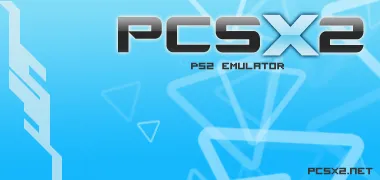

---
authors:
  - cottonvibes
date: 2009-08-05 00:00:00
description:
  The pcsx2 logo design competition ended a while ago, and we had a lot
  of great submissions
draft: false
title: Logo Design Winners
---

The pcsx2 logo design competition ended a while ago, and we had a lot of great submissions (check them out
[here](http://forums.pcsx2.net/Thread-PCSX2-Logo-Design-Entries) ).

<!-- truncate -->

After weeks of voting, we were finally able to narrow down the winners:

**New Logo by Nanxo:**

**New About Box Pic submitted by Tayfun and created by
[ongakujunkie](http://edwinhuang.com/) :**

**New Icon by Jeonkz (modded for transparency by Air):**

**New favicon for Portal and Forums by NeoCloudstrife:**

We decided the 2nd place in the icon competition would be used as the
small favicon sites have when you bookmark them,on the portal and
forums, since we did not have one
😊

So congratulations to [Nanxo](http://forums.pcsx2.net/User-Nanxo) ,
[Tayfun](http://forums.pcsx2.net/User-Tayfun) ,
[Jeonkz](http://forums.pcsx2.net/User-jeonkz) and
[NeoCloudstrife](http://forums.pcsx2.net/User-NeoCloudstrife) for their
awesome designs! And many thanks to all who entered, there were many
great designs and it was hard picking the winners!

Look forward to seeing these new designs in our next official release
with our new wxWidgets GUI!
😊
