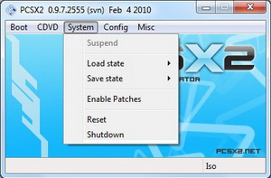
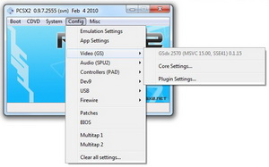
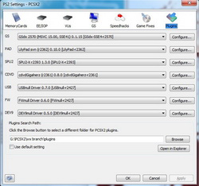
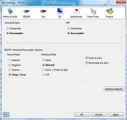
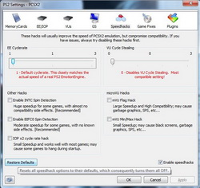
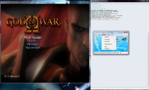

---
authors:
- bositman
date: 2010-02-10 00:00:00
description: Development of the new 0.9.7 version of the emulator with the all new
  GUI is going strong and soon all the old GUI functionality will be implemented.
  After that it's bug hunting time and then a beta release!
draft: false
tags:
- devblog
title: PCSX2 0.9.7 Sneak Peek!
---

It has been a long time since the last news concerning PCSX2, so I
thought I'd bring you up to date
😊
Development of the new 0.9.7 version of the emulator with the all new GUI is going strong and soon all the old GUI functionality will be implemented. After that it's bug hunting time and then a beta release!

<!-- truncate -->

In this news post I'll present some of the exciting new features of the
new GUI builds, for those of you who haven't checked it out yet!
Click the images to view them in normal size

-   All new menus, for improved usability and faster configuration
-   On the fly suspend and resume, perfectly stable, safe and fast
-   On the fly setting switching or even plugin switching
-   Compatible with Aero Glass and Windows eye goodies

-   Threaded GUI, for better responsiveness, usability and error
handling
-   Simplified plugin configuration dialog, with more options
-   Console output will no longer slow down the emulator when flooded
thanks to threading
-   Saving states done in the new thread, so gameplay doesn't even
flinch when you save

-   New CPU configuration, more user friendly and noob proof with a
restore defaults button
-   New GS configuration, with more options like Turbo and Slow motion
FPS adjustments

-   New Speed hacks configuration, with more warnings ( like anyone
reads them!) and a restore defaults button
-   All options have tooltips (text that appears after you leave the
cursor on a control for some secs) explaining what each of them do
-   Screen shot button in every dialog (lower left corner) to easily
take shots of your configurations

That's it! Hope you like the new look and functionality, we are doing
our best to make PCSX2 as user friendly as possible. Of course there are
still some features not shown here, we have to keep something to
surprise you!

There is no set date for the beta release, since there are still a bunch
of bugs lying around but it's safe to say we are getting close
😊
