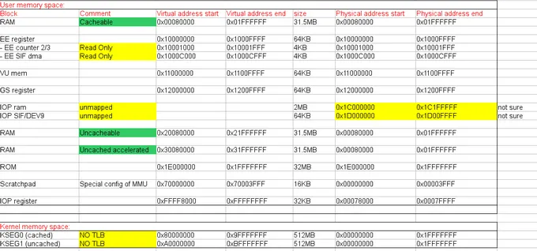

---
authors:
- gregory
date: 2015-02-02 00:00:00
description: After a long delay, this is the second part of the MMU mini-presentation
draft: false
tags:
- devblog
title: Mmu Mini Series Part2 4
---

Hello PCSX2 followers,

After a long delay, this is the second part of the MMU
mini-presentation. In the previous chapter we saw that MMU allows giving
a virtual address space to a process. Besides, I told you MMU controls
the cache behavior (cacheable/uncached accelerated/uncached). First, let
me quickly explain the different cache accesses. Then I will introduce
the default memory mapping of the PS2.

<!-- truncate -->

So let's start with a short explanation of the cache. The goal of
caching is to hide RAM latency. RAM is a very slow memory. It's not as
slow as an HDD/SSD but still very slow. Any access requires a full
protocol to prepare the data. You need to select the line, the column,
charge output buffer... A RAM access costs you a hundred of CPU cycles.
In the meantime, the CPU is idling if it misses instruction or data. It
is very annoying, only 10% of the CPU would be used. The biggest cost is
the setup of the RAM, transfer speed remains reasonable. So a 64 bytes
transfer is a bit slower than a 4 bytes transfer. But a 64 bytes
transfer is way faster than two 4 bytes transfers. Therefore, it is more
efficient to load/store data by 64 bytes packets. Note: generally cache
lines are 64 bytes wide.

Employing a cache is a clever solution to avoid multiple CPU-RAM
transfers. It is based on two properties: spacial locality
(instructions/data are closely packed) and temporal locality (program
loop/reuse of the same data again and again over the time). The general
idea of caching is to create a small, but fast memory. 1% of your RAM
data is used 99% of the time (a.k.a. the general 90/10 rules). So if you
just put those 1% inside the cache, 99% of your accesses will be fast

Well let's say not too slow, even the fastest cache still has 2 or 3 CPU
cycles access time.

Cache is really nice but there are a couple of scenarios where you
mustn't use it: Coherency and performance. Wait, we just said that cache
accelerate memory access and so improves performance? That is true, but
only if the data has temporal locality. If you want to access the data
only once, it won't be efficient. You pay an extra latency cost (the
cache layer) for no gain because data won't be reused. It is even worse!
Useful data will be evicted from the cache. We really want to keep the
1% of frequently used data on the cache. Don't worry, we aren't doomed,
there is still a way to accelerate this kind of transfer. The PS2 has a
special mode called "uncached accelerated" that will be discussed a bit
later.

Now let's talk about coherency. Coherency is very critical to ensure
system stability. The cache is a copy of RAM. If the hardware (typically
the DMAC) updates the memory content, the data of the cache will be
wrong and your CPU will be screwed. This kind of memory is called
volatile, it means hardware can update it without any notice to the CPU.
Cache will be disabled to ease the management of this special memory. No
cache means no copy, means no coherency issue.

You now understand the reason to disable the cache. Let's continue with
the explanation of the "uncached accelerated" mode. I told you that a 64
bytes transfer is much faster than several small transfers. There must
be a way to exploit this feature. CPU registers are only 16 bytes wide,
way too short. So the engineers added a couple of extra buffers (64
bytes wide). Those buffers allow you to transfer 64 bytes at once from
the RAM without any pollution of the cache. You directly do a
computation on the data and send it back to the RAM, therefore you can
fully exploit your RAM. Note, on your PC this feature is often called
write-combining.

Let's conclude this cache chapter. In short there are 3 cache modes
1. uncached for volatile access
2. uncached accelerated for data that will be used once
3. cache to accelerate all remaining situations

On the PS2, 95% of the MMU job is to select the cache. The remaining 5%
is to forbid the game to use/access special resources (OS
counter/SIF/kernel code). Very few games (I know only one) use the MMU
to remap a page during the game. Nearly all games use a default mapping
that allows accessing all hardware resources.

PS2 MMU specification:
Entries: 48 double pages (pages are mapped by block of two, the odd and
even pages, so in total you can map 96 pages)
Page size: 4K/16K/64K/256K/1M/4M/16M

Default mapping: 39 entries already allocated and reserved for the OS.
Only 9 entries remain for the games but we don't care. As I said, all
the memory is already mapped, so we don't need more. Besides, it removes
the handling of TLB miss that is very expensive. It is clearly much more
efficient than a standard PC.

Here is an overview of the TLB configuration.

As you can see, there are 2 modes, a USER mode for the game and a KERNEL
mode for the PS2 OS. The mode selection is done by a CPU configuration
register. Syscalls are generally used to switch to higher privilege
modes, but that's another story, albeit very interesting

Please note that TLB is only used for USER mode. The kernel is god, it
can access anything therefore it uses physical addresses directly. On
the contrary the game is limited to the mapped memory, it means that
games can only access 31.5MB. Besides, some registers are read only (EE
counter 2/3 and SIF DMA), in others words they are reserved for the
kernel.

It's about time that we answer the mini quiz of the previous series:
\* The first 512KB of RAM is not virtually mapped because it is at the
location of the OS, do you know how the kernel will access this
location?
The kernel is like god it can use physical addresses directly. The
address will range from 0x8000\_0000 to 0x9FFF\_FFFF. Those accesses are
cache accelerated.

\* A hardware component needs to access the memory without the CPU
intervention. Do you know which one? Do you know how the addresses are
handled?

The component is the Direct Memory Access Controller (aka DMAC). This
component is allowed to do a Direct Memory Access (DMA) behind the CPU,
in others words it can copy data around the chip. This way the CPU can
work without any interruption. However, memory is volatile from the CPU
point of view so access to this memory must be done uncached. In
particular the kernel will use this address range
0xA000\_0000-0xBFFF\_FFFF

To conclude this post, the memory subsystem is very critical for
performance and the MMU is a very powerful mechanism to control memory
access. However, the MMU is completely underused on the PS2. Let's be
honest it is a waste of die space. A hardwired implementation (as done
by older consoles) would have been 10 times more efficient. So why did
Sony keep the MMU? I don't know! Here are some possibilities:

\* to support Linux
\* no right to modify this part of the CPU (remember it is based on
MIPS)
\* to reduce cost and time to market

That's all for today. Next time you'll see how I managed to make Goemon
(
<http://forums.pcsx2.net/Thread-Bouken-Jidai-Katsugeki-Goemon-SLPM-65014-J>
) playable with this knowledge.
