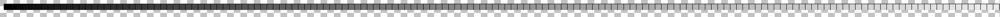
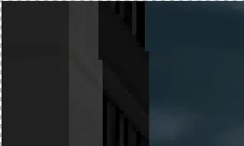
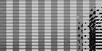
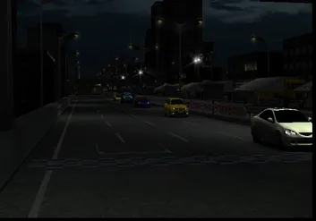
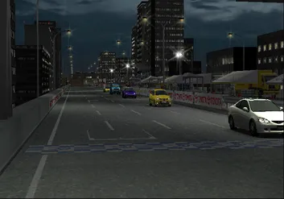
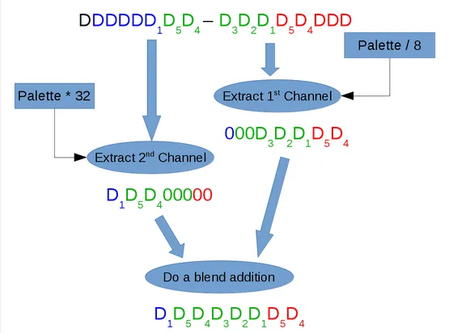
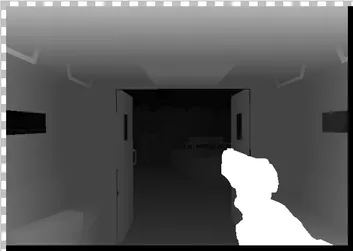
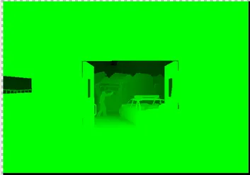

---
authors:
- gregory
date: 2016-08-03 00:00:00
description: GSdx got various improvements recently, issues were fixed on games such
  as Metal Gear Solid 3, Gran Turismo 4, Tekken 5, Tales of Legendia and Urban Chaos.
  All of those games use a certain effect that I have nicknamed as the Channel Shuffle
  Effect
draft: false
tags:
- devblog
title: Channel Shuffle Effect
---

<!-- truncate -->

# Introduction

Dear PCSX2 users,

GSdx got various improvements recently, issues were fixed on games such
as Metal Gear Solid 3, Gran Turismo 4, Tekken 5, Tales of Legendia and
Urban Chaos. All of those games use a certain effect that I have
nicknamed as the **"Channel Shuffle Effect"**. All games use a variation of this effect but each time
the effect proved to be memory expensive and it was very slow, even with
the best computers. The effect is very interesting because it explains
the rendering/GPU architecture evolution from a fixed unit to a
processor. So I decided to take this opportunity to explain it the best
I can.

# II) GPU evolution/revolution : Fixed Unit vs Shader Unit

So let's start with a bit of history. A long time ago, nearly 20 years
ago! (yeah the PS2 isn't in its prime youth), GPUs were hardwired to
execute fixed rendering tasks. Back then, they were called 'acceleration
units'. Hardwired renderers give you speed, power efficiency, but it is
costly (silicon wise) and, well, they are hardwired to do a specific
task. It was fine at the start, but then game designers wanted more and
more effects. A new effect would have required a new GPU with a new
fixed function unit. It was kind of feasible on the PC market but not in
the console market where a new GPU is released only every 5 years. So
game designers tricked the fixed function unit to emulate some new
effects (such as gamma correction, depth of field, ...). The hardware
was fast, but the emulation of such effects required more work than the
real rendering of the image. Overhead was quite enormous. Accelerated
hardware was dead. Welcome the new king, Shaders.

So what is a Shader unit? It is basically a small processor that
executes software code designed specifically for them. The issue is that
processors are slow, utterly slow, however they are cheap (silicon
wise). However a processor could execute any effect you want. So in
order to compensate for the slowness of those processors, thousands of
them are put in parallel. Hence complex effects can be done essentially
for free.

Now you probably understand the difference between a fixed unit and a
shader unit. Let's get back to the GS emulation.

# III) The GS case

GS is a pure fixed unit. You can basically configure the texture format,
the framebuffer format and the final blending equation. Note, the
blending equation is quite basic too.

You can configure the GS to do 2 main color operations,

-   primitive color \* texture color
-   primitive color (when no texture is available)


Texture sampling operations are done on the 4
channels(Green/Red/Blue/Alpha) at once. You can't select any one of
them. It is all or nothing.

But how does a game like Gran Turismo 4 manage to apply a
brightness/contrast effect? How can a game apply a depth effect based on
the upper 6 bits of the 16 bits depth buffer? It's crazy, game designers
were high ! Yes, you guess it right, they abused magic mushrooms!

# IV) First example: Gran Turismo 4 rendering

Fasten your seat belt and let's dive into the Gran Turismo 4 rendering
engine and look at the brightness effect.

The engine uses 2 textures as input. The image that will get the
brightness correction applied and a palette. The palette is basically a
lookup table or an array of colors. It allows to transform an index into
a new color. Basically the game will save the brightness correction
function in the palette. So color 10 will be transformed to 15.

Here's the palette that will do the brightness correction:



Here is an HLE (High Level Emulation) shader implementation.

```cpp
vec4 rt        = sample_input_texture();
output_color.r = sample_palette(rt.r).r;
output_color.g = sample_palette(rt.g).g;
output_color.b = sample_palette(rt.b).b;
```


It is only a few lines of shader code. First line will read the current
texture color. The 2nd line will apply the brightness correction on the
red channel. The 3rd will do the same for the green, and the 4th for the
blue. It can all be done with a single draw call and it is very fast
even on a slow computer. Last but not least it took 3 minutes to
implement it.

But I have cheated, this isn't the GS way, it is the effect that would
have been implemented on a standard GPU. The GS method is quite
harder.

First of all, in order to improve the memory access performance on the
GS, the framebuffer will be split into many (150) tiny framebuffers of
64x32 pixels. Actually it is the size of a GS memory page. Of course
GSdx doesn't like this as it needs to allocate a 1280x1024 pixel
framebuffer for every one of those tiny 64x32 pixel framebuffers, this
lead to VRAM spikes at certain scenarios.

Eventually the brightness effect will be applied on each framebuffers.
So yes it is executed 150 times. It requires around 10 GS equivalent
draw calls though due to emulation overhead it would be around 15 GPU
draw calls. Let's put some numbers in perspective:

\*A good limit for GPU game is \~1000 draw call

\*Gran Turismo 4 frame is 2250 GS draw calls so likely between 2500-3000
draw calls! Ouch.

\*The Gran Turismo 4 brightness effect costs 1500 GS draw calls, it is
huge! 66% of the frame rendering is only a single effect. In others
words, removing the effect would make the GS emulation nearly 3 time
faster.

Now let's decompose the effect. The equivalent of

```cpp
c.r = sample_palette(rt.r).r;
```


It is executed 3 times, one for each channel (Red/Green/Blue). The above
explanation is done for a framebuffer of 64x32, you need to repeat it
enough times to cover the full screen. It is already costly on
performance to do it once but it should be executed 150 times !

So the effect is based on a single trick, write the image into a RGBA8
color of size 64x32 but read it back as a 8 bits integer index of the
palette. A 32 bits colors contains four 8 bits channel. So for the gs,
the image is now 128x64. Of course you can't magically change the size
of a texture in a modern GPU neither the format. So you need to convert
it. And guess what? it is quite expensive.

Here's the picture of the initial format (aka human format) and then the
GS format:




Yes it is nice but it is even more complex than you think. Granted, it
isn't easy to see it but the texels aren't in the same order. You can
infer some small rectangle (8x2 texels), they contain a single channel
of the initial color.

Will anybody find the original image part (full image can be seen
below)?



You could imagine the complexity to debug the effect.

As I said in the beginning the basic operation of the GS is "primitive
color \* texture color". We only want to write the red channel so
primitive color will be (1.0f, 0.0f, 0.0f, 0.0f) i.e. red will be one
and the other channels will be 0. So GS output is basically the red
channel of the texture color. Now the texture color case is left, of
course you can't just render a single sprite. You only want to sample
the 8 bits index that used to be the red channel of the frame. The value
will be converted by the palette. And you're done

No I'm kidding, we've just started.

So Gran Turismo 4 will render 16 sprites to cherry pick the correct
index and try to put it back mostly in the correct order. Why mostly in
order? Because the game uses an extra optimization here, if you want to
fully descramble the texels, it would likely requires too many sprites
rendering, something around 256 sprites. So rendering will be done
scrambled for all channels.

They could have send a kaleidoscope in the game package but finally they
decided it was nicer to unscramble the texels. Again, a new trick

Yes we love tricks

The framebuffer will read back as a 256x1 palette. Wait you said that
framebuffer was 64x32! Yes it would be read back 8 times as 8 palettes.
And the input texture is really special, you can see it below. The
texture contains the position of the future pixels and you guessed it
right, it would unscramble the mess. It is efficient (well efficient for
the GS) because you can unscramble your pixels with only 8 extra
sprites. And that's it.

Here's the special texture to unscramble data:


Plus some screenshots of the effect (before/after)




# V) Second example: Urban Chaos rendering

The new trending effect when the PS2 was released was the depth of field
effect. Basically, it's an effect that depends on the depth. A basic
example will be a darker/blurrier object if it's far away. It's rather
basic to implement, you just need to modulate the color based on the
depth value. Unfortunately you can't read the depth value like that. So
let's see what the game does.

Urban Chaos uses a 16 bits integer depth format. Actually the game
limits the rendering to 11 bits. So the depth ranges from 0 to 2047. The
game creators decided that the top 8 bits will be enough to implement
the depth modulation. But a single issue remains, how to extract those 8
bits! Again it will apply on a small framebuffer, and it will consume
tons of draw calls, tons of memory.

At a higher level, it's very close to Gran Turismo. Close, but not the
same. Good news, it's easier than Gran Turismo as you don't want an
accurate depth information so you don't need to bother with shuffle
pixels. So we have seen a way to read back a single channel of a
framebuffer and how to apply a correction factor. Urban Chaos will do
the same but on the depth texture.

Here's a small drawing to explain the now easy process:



At the top of the drawing, you have the 16 bits depth. The GS will read
it as a color texture (aka RGB5A1) so I set some nice colors for the
red, green and blue channels. The depth is split into two 8 bits
channels, be aware it doesn't map with the color channel because the
effect works on 32 bits memory format. I know it's a bit confusing.
Anyway the first step will be to extract the first 8 bits then apply a
division by 8. Which is equivalent to removing the 3 bits of the right.
The second step will be to extract the remaining 8 bits then apply a
multiplication by 32. It's equivalent to shifting the data to the left 5
times. The last step is a blending addition between the 2 shifted depth
colors and we are done. We managed to extract only the interesting bits
of the depth. The new texture could be used to modulate any effects
based on depth information.

Here's the float depth buffer of the GPU:



And now, the greenish texture generated to modulate the depth effect



# VI) Conclusion


It is time to conclude this blog about the channel effect. There were
two possible ways to implement the effect on GSdx. The traditional
approach would be to emulate all those draw calls, manage all texture
conversions and so on. In short, emulate the GS that emulates a GPU OoO.
Unfortunately, even the best PCs would struggle.

So I implemented the alternate solution, replaced all the mess with a
couple of HLE shaders. It's very efficient, thousands of draw calls were
replaced by 1 or 2 draw calls. Unfortunately, it isn't perfect either.
There are two limitations, it requires to have some HLE shaders by game.
Currently not all games are supported (Ghost in the Shell, Manhunt 2,
Ridge Racer). And the core (EE/VU) will still generate a ton of
primitives to do the effect, albeit GSdx will happily throw everything
in the trash, nevertheless it is heavy on the core emulation.
