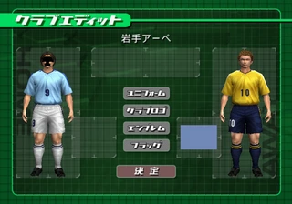

---
authors:
  - lightningterror
date: 2020-10-01 00:00:00
description:
  On the previous report the highlight was GSdx improvements mostly. This
  one on the other hand is Core changes, and A LOT of core changes. Enjoy!
draft: false
tags:
  - progress-report
title: Q3 2020 Progress Report
---

On the previous report the highlight was GSdx improvements mostly. This
one on the other hand is Core changes, and A LOT of core changes. Enjoy!

<!-- truncate -->

# GSdx Improvements

<PCSX2PRLink authors="lightningterror" prNums="3507">
  (Direct3D10/11 HW) SetupIA, allow sprite conversion to be done on the CPU when
  applicable
</PCSX2PRLink>

Port from OpenGL

- Helps sprite rendering inLets Make a J-League Pro Soccer Club (see image comparison below).

Before

After

## Other GSdx Changes

<PCSX2PRLink authors="tadanokojin" prNums="3508">
  (Direct3D10/11) Modernize swapchain and device creation
</PCSX2PRLink>

<PCSX2PRLink authors="tadanokojin" prNums="3516">
  (Direct3D10/11) Remove legacy d3dcompiler code.
</PCSX2PRLink>

<PCSX2PRLink authors="refractionpcsx2" prNums="3534">
  (HW) Improve dithering.Gets rid of line artifacts down the screen due to 16bit
  colour limitations
</PCSX2PRLink>

<PCSX2PRLink authors="KrossX" prNums="3575">
  (OpenGL HW) Fix/improve line scaling. Port from Direct3D 10/11
</PCSX2PRLink>

<PCSX2PRLink authors="lightningterror" prNums="3739">
  (OpenGL HW) Swap DATE_GL42 with DATE_GL45 on sw blending draw
</PCSX2PRLink>

It will allow to run sw blending with DATE draw (DATE Accuracy Full) which was previously DATE_GL42 by default

<PCSX2PRLink authors="JibbityJobbity" prNums="3562">
  (OpenGL) Remove GLX in favor of EGL
</PCSX2PRLink>

<PCSX2PRLink authors="lightningterror" prNums="3705">
  (OpenCL) OpenCL renderer removed
</PCSX2PRLink>

(OpenCL) OpenCL renderer which was barely maintained and rarely used for debug purposes only has been completely removed in our quest for cleaning up the codebase

<PCSX2PRLink
  authors="RedDevilus,lightningterror"
  prNums="3706"
  shas="0c67dc99f7adf1f4bac88c67ac895fe84ac9c750"
>
  (HW) Add dithering option to HW renderers
</PCSX2PRLink>

- Dropdown menu for 3 options: Off (No Effect/ Been always like this), Scaled (Strongest effect/obvious), Unscaled (Weakest effect/less obvious)
- Change Default dithering mode from Scaled to Unscaled

<PCSX2PRLink authors="tadanokojin" prNums="3723">
  Purge Direct3D11 Software renderer option
</PCSX2PRLink>

F9 has been modified on Windows to have the following functionality:

If the renderer config is set to HW, it will toggle between the
respective HW renderer (OGL/DX) and SW

If the renderer config is set to SW, it will toggle between SW and the
renderer returned by GetBestRenderer()

Before

After

In a nutshell it merges the software renderers. There's no need to have
multiple ones, and it makes it easier for the end users.

<PCSX2PRLink authors="lightningterror" prNums="3702">
  Remove DynamicCRCHack feature
</PCSX2PRLink>

<PCSX2PRLink authors="lightningterror" prNums="3564">
  Remove unused Uber_ATST shader code
</PCSX2PRLink>

<PCSX2PRLink
  authors="lightningterror"
  shas="b00c603e0bcbe3dc60b8a72ece2e3ddc3a0288c7"
>
  SMT: Digital Devil Saga 1 & 2, SMT: Nocturne
</PCSX2PRLink>

<PCSX2PRLink
  authors="lightningterror"
  shas="13ff9ab7dbc22cf41e0edf3f8cedbdf19047efc3"
>
  Time Splitters 2
</PCSX2PRLink>

<PCSX2PRLink
  authors="lightningterror"
  shas="366e7b9dbd447aee61fba1f9441e0d1256ee8aa2"
>
  Grandia3
</PCSX2PRLink>

<PCSX2PRLink
  authors="lightningterror"
  shas="baabbc3c9fe57eadc8bc3f6539965dc169277999"
>
  Genji
</PCSX2PRLink>

---

# Lilypad Improvements

<PCSX2PRLink authors="lightningterror" prNums="3323">
  Remove PSX/PS1 emulator compatibility
</PCSX2PRLink>

Removes the capability of running Lilypad on ps1 emulators that support
a plugin interface like ePSXe. PS1 games will still be played normally
without any issue when using PCSX2.

---

# SPU2-X Improvements

<PCSX2PRLink authors="kenshen112" prNums="3532">
  Correction of timings reset and audio sample rate for ps1 mode
</PCSX2PRLink>

---

# Core Improvements

## 64bit Recompiler support. By [tellowkrinkle](https://github.com/tellowkrinkle) and [beaumanvienna](https://github.com/beaumanvienna)\*\*

It's been a long awaited goal for us and we are very happy with the
progress of the 64bit work that's been put in recently. That said there
are still a couple of issues left to take care of before we start
providing fully working builds to the public on Orphis buildbot. Those
that want to take the risks and still give the 64bit builds a go then
they can fetch appveyor artifacts or build the source code themselves
and give it a go Performance should be -/+ 5% for anyone expecting huge performance
gains. For the technical details see the following PRs below.

<PCSX2PRLink authors="tellowkrinkle" prNums="3524">
  Moves all VTLB pointer manipulation into dedicated classes for the purpose
</PCSX2PRLink>

Should allow the algorithm to be changed much more easily in the future.

<PCSX2PRLink authors="tellowkrinkle" prNums="3523">
  Allocate memory in an x86-64-compatible way
</PCSX2PRLink>

<PCSX2PRLink authors="tellowkrinkle" prNums="3512">
  Fix codegen on x86-64
</PCSX2PRLink>

Makes x86emitter emit the x86-64 machine code you would expect it to.

<PCSX2PRLink authors="tellowkrinkle,beaumanvienna" prNums="3608">
  64-bit recompilers
</PCSX2PRLink>

Makes recompilers compatible with x86-64.

## Other Core Improvements

<PCSX2PRLink authors="refractionpcsx2,psi-rockin" prNums="3537">
  EE/IOP: Timer Interrupt Handling
</PCSX2PRLink>

Backport from Dobiestation

- Don't interrupt if compare/overflow flag is already set.
- Removed GameDB patches for Harry Potter Prisoner of Azkaban and
  Chamber of Secrets as they are no longer required.

PSI-Rockin made an excellent post explaining the functionality/technical details. You can read more about it [here](https://www.patreon.com/posts/39218662).

<PCSX2PRLink authors="refractionpcsx2" prNums="3539">
  VIF: VIF MSCAL instructions wait on VU T-Bit stop
</PCSX2PRLink>

Fixes the following games from crashing, and removes gamedb patches for
them since they now work properly:

- The Sims
- Spiderman 3
- Sharks Tale
- Maybe some bits of Over the Hedge
- Pitfall (both demo and full game)
- Gumball 3000
- Enter the Matrix
- Evolution Snowboarding

<PCSX2PRLink authors="refractionpcsx2" prNums="3555">
  IPU: Perform an interrupt on IPU_CTRL Reset
</PCSX2PRLink>

Backport from Dobiestation

Doing this reset performs a forced command end, meaning the IPU will run
through the procedure of ending any command running and telling the core
that it is done, even if there is no command currently active.

Fixes Fightbox and Sakura Taisen 3.

<PCSX2PRLink authors="refractionpcsx2,kozarovv" prNums="3593">
  VU: Make VU run closer in sync with EE, implement Mbit
</PCSX2PRLink>

Implement basic cycle counting for COP2 operations, implement COP2 detection while not interlocking, implement Mbit, drastically change cycles required to run for every microprogram. Improved handling of edge cases for scenarios where COP2 updates flags.

As explained [here](https://www.patreon.com/posts/shadow-of-fixing-33354075) in PSI's blog post, hardware tests proved that VU run at the same speed as EE mips core. This is important as the EE can read values from VU0 while a VU program is running using COP2 commands such as CFC2 (Copy From COP2/VU0), so it is important to run VU0 at the same speed as the EE, this was particularly important for games using M-Bit synchronization (Mike Tyson, My Street etc) and games which start a VU program and then copy a value to VU0 to be used by the new program, an example of this happening was 24: The Game.

Depending on if the game is expecting the value written to be used or written after the register is used, the VU needs to run either ahead or behind and it varies per game, so in this case it's essential that we rely on a new gamefix that we implemented calledVU0KickstartHack.

Fixed games list:

- (VIF) Hitman games - Resolve potential crashes with TLB misses or
  FIFO errors
- 24: The Game, Primal, Ghosthunter - No longer need patches to run at
  full speed
- Air Rescue Ranger - Ground no longer has SPS
- Amplitude - FreQ avatars no longer have SPS
- Gift, Woody Woodpecker, Kaan - Now runs at the proper speed
- Lotus Challenge - Cars are no longer bouncy
- My Street - Missing characters are now visible. (Note: they still
  exhibit a small amount of SPS in microVU0, the VU0 Interpreter does
  not have this issue.)
- Mike Tysons Heavyweight Box - Characters are no longer asserting
  their dominance by t-posing. See-through characters are also fixed.
- Next Generation Tennis 2003 - No longer needs a patch to fix SPS
- Nichibeikan Pro Yakyuu: Final League / World Fantasista - Random
  glitches are gone
- Phase Paradox - Lighting and camera in cutscenes are fixed
- Rayman 2 Revolution - Resolved character collision issues with the
  ground
- Sega Superstars Tennis - SPS on hands/feet is now gone
- Tiger Woods PGA Tour 2002 - Fixed player stance
- Wakeboarding Unleashed demo no longer crashes at the loading screen
  (also requires XGKick hack)
- Totally Spies Totally Party! - SPS reduced - (Note: requires EE
  Cyclerate + 3 to completely fix.)
- Twisted Metal Head-On - Black doors have now proper colors
- Wakeboarding Unleashed - No longer hangs getting to the menu on
  release builds
- World Series Baseball 2k3 - No longer hangs on the loading screen
  (game still hasother issues)

Here you can see the before (left) and after (right) images.

<SliderCompare
  before={
    require("./img/Mike-Tysons-Heavyweight-Box-before-resize.webp").default
  }
  after={require("./img/Mike-Tysons-Heavyweight-Box-after-resize.webp").default}
/>

<SliderCompare
  before={require("./img/MyStreet-Before-resize.webp").default}
  after={require("./img/MyStreet-After-resize.webp").default}
/>

<SliderCompare
  before={require("./img/SegaTennis-Before-resize.webp").default}
  after={require("./img/SegaTennis-After-resize.webp").default}
/>

<SliderCompare
  before={require("./img/TotallySpies-Before-resize.webp").default}
  after={require("./img/TotallySpies-After-resize.webp").default}
/>

<PCSX2PRLink authors="refractionpcsx2" prNums="3660">
  microVU: Fix m-bit state and range merging
</PCSX2PRLink>

Fix state saving when m-bit is reached.
Fix range merging to encompass whole ranges of programs.

- Fixes shadows in The Shadow of Zorro
- Fixed slight SPS in Totally Spies Totally Party! Still needs Cyclerate +3 however

<PCSX2PRLink authors="refractionpcsx2" prNums="3675">
  GS/Counters: Fix CSR Swap and VBlank Interrupt timing
</PCSX2PRLink>

Backport from Dobiestation

- Fixes the Titantron's on the WWE games (Except Shut Your Mouth).
- Fixes the frame order for the following games, so they look less
  blurry and don't need the interlacing mode swapped:
- Soul Calibur 2
- World Rally Championship
- Mike Tysons Heavyweight Boxing
- Urban Reign
- Mortal Kombat Shaolin Monks

Based on data gathered from PS2 console tests.

<PCSX2PRLink authors="refractionpcsx2" prNums="3683">
  VIF: Set decoding status on VIF stall
</PCSX2PRLink>

Removes an old VIF hack.

Fix GIF resets.

Fixes the memcard screen on Onimusha Blade Warriors, no longer
invisible.

Reduces frequency of VIF spamming the console in Ratchet & Clank when
completing the game.

<PCSX2PRLink authors="kozarovv" prNums="3439">
  Add support for loading rom2
</PCSX2PRLink>

Fixes/adds Chinese bios support. This also fixes a number of Chinese
region games with the added feature.

So far we have 3 games confirmed working:

- Ape Escape 2 (SCCS 40001)
- XIGO: Zuihou de Touzi XIGO (SCCS 40004)
- Gran Turismo 4 (SCCS 60002)

Other games on could be fixed as well, someone just needs to test/verify
them. The full list can be seen on the pull request itself.

<PCSX2PRLink authors="GovanifY" prNums="3591,3724">
  New WIP Feature: Socket IPC implementation
</PCSX2PRLink>

An IPC protocol was added to PCSX2. This feature gives you a header-only C++ library with bindings in C, Python, Rust, Lua and C\# which allows you to communicate with the emulator and the underlying game it emulates. Ever wanted a game to trigger a save state? That's how you'd do it! Want to make advanced TAS tools? AI based players with a fancy GUI to visualize all your neuronal networks? This should do the trick!

Note that all the main planned IPC features are not yet merged/developed, so all of this isn't possible yet but should be soon.

For more information you can check the PR's themselves for details.

# The following Plugins have been merged in to the core

You heard it right folks, PCSX2 will require 2 less plugins now to
fiddle with.

<PCSX2PRLink authors="MonJamp,GovanifY" prNums="3518">
  CDVD
</PCSX2PRLink>

<PCSX2PRLink authors="GovanifY" prNums="3716">
  FW (FireWire)
</PCSX2PRLink>

---

# GameDB Improvements

<PCSX2PRLink authors="RedPanda4552" prNums="3418">
  Add Xenosaga save point crash patch
</PCSX2PRLink>

- Other GameDB additions or deletions have been done throughout the Q3 cycle as well.

---

# Misc Improvements

<PCSX2PRLink authors="tellowkrinkle" prNums="3424">
  More preliminary work on MACOS support
</PCSX2PRLink>

<PCSX2PRLink authors="xTVaser" prNums="3667">
  Change the console logger's theme on the fly
</PCSX2PRLink>

<PCSX2PRLink authors="RedDevilus" prNums="3448,3540">
  Update old Dark Theme for the PCSX2 Console to Modern Dark theme
</PCSX2PRLink>

<PCSX2PRLink authors="arcum42" prNums="3597">
  PCSX2 GUI Menu changes
</PCSX2PRLink>

<PCSX2PRLink authors="RedDevilus" prNums="3457">
  Revision of tooltips/descriptions and other fixes for PCSX2 (LilyPad + others)
</PCSX2PRLink>

<PCSX2PRLink authors="xTVaser,turtleli" prNums="3687,3702,3719">
  (CI) Move/migrate the project to use Github Actions instead of Appveyor and
  Travis
</PCSX2PRLink>

<PCSX2PRLink authors="lightningterror" prNums="3652">
  Remove unused cheats and browser source files
</PCSX2PRLink>

<PCSX2PRLink authors="arcum42" prNums="3525">
  More gtk removals and OnePad dialog tweaks
</PCSX2PRLink>

<PCSX2PRLink authors="lightningterror" prNums="3611,3614,3623">
  Remove zzogl, gsdx legacy, zerogs and zerospu2 legacy plugins from master
  branch
</PCSX2PRLink>

<PCSX2PRLink authors="lightningterror" prNums="3688">
  (Tools) Moved GSDumpGUI in it's own repository
</PCSX2PRLink>

Initial release has been published as well so developers can download and use it without the hassle of compiling

---

# TAS (Tool Assisted Speedrun) Utility Improvements

<PCSX2PRLink authors="xTVaser,sonicfind" prNums="3669">
  Resolve issues around playing and creating input recordings under certain
  scenarios
</PCSX2PRLink>

<PCSX2PRLink authors="xTVaser" prNums="3293">
  Resolve TAS Recording Issues for Linux / OnePad users
</PCSX2PRLink>

<PCSX2PRLink authors="xTVaser,sonicfind" prNums="3690">
  Resolve TAS Recording issues which lead to recordings prematurely stopping
</PCSX2PRLink>

<PCSX2PRLink authors="xTVaser" prNums="3299">
  Resolve TAS Recording related hang when PAD plugin is open/closed while a game
  is paused
</PCSX2PRLink>

<PCSX2PRLink authors="xTVaser" prNums="3480">
  Corrections to TAS recording file's header data
</PCSX2PRLink>

---

And that's all from us, see you next time in our Q4 Report!

# Metadata

2020 Q3:
(dev110 to dev350) (2020-07-01 - 2020-09-30)
