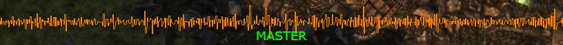

---
authors:
  - lightningterror
date: 2021-03-08 00:00:00
description:
  This quarter has been really amazing for us and for our users that enjoy
  using PCSX2.
draft: false
image: ./feature-q4-2020-report.webp
tags:
  - progress-report
title: Q4 2020 Progress Report
---

This quarter has been really amazing for us and for our users that enjoy
using PCSX2.

<!-- truncate -->

We've made some outstanding progress, hope you guys enjoy the read.

# Core Improvements

## Plugins merger in to core continuation

As we mentioned in our previous report we are continuing merging the
plugins in to the core which bring us variety of benefits.

For people that used different plugins for specific features that aren't
available in the plugins we merged don't worry, we are working on adding
those features as well, be patient.

Currently the following plugins have been merged in to the core:

<PCSX2PRLink authors="GovanifY" prNums="3782">
  Merge DEV9ghrz into core
</PCSX2PRLink>

DEV9: For the DEV9
feature that handles PS2 hard disk drive and Ethernet emulation we
merged the dev9ghzdrk plugin in to the core.

<PCSX2PRLink authors="GovanifY" prNums="3756">
  Merging SPU2-X into core
</PCSX2PRLink>

SPU2: For the SPU2
feature that handles PS2 audio we merged the SPU2-X plugin in to the
core.

<PCSX2PRLink authors="GovanifY" prNums="3889">
  Merge USB into core
</PCSX2PRLink>

USB: For the USB
feature we merged the USBqemu-wheel plugin in to the core.

<PCSX2PRLink authors="GovanifY" prNums="3994">
  Merging PAD into core
</PCSX2PRLink>

PAD: For the PAD
feature that handles PS2 controller input we merged LilyPad for Windows
users and OnePad 2.0 for Linux/Mac. In the future we will transition and
combine both of them so all missing features get added.

## Counters improvements

<PCSX2PRLink authors="RedPanda4552,refractionpcsx2" prNums="3785">
  Counters: Tighten tolerances on framelimiter and smooth out frame pacing
</PCSX2PRLink>

Comparing PCSX2's old framelimiter with RTSS showed there was room for
improvement. Frametimes regularly would jump up and down in various
situations. This change smooths out frame pacing substantially across
the board (easily visible in RTSS). We have some comparisons below which
you can see the differences, alternatively our users can check out the
relative PR for more details.

Note: Master(Before) and (After)

Ratchet & Clank 2

Champions - Return to Arms

Metal Arms - Glitch in the System

<PCSX2PRLink authors="tadanokojin" prNums="3862">
  Counters: account for vertical frequency differences in non-interlaced analog
  modes
</PCSX2PRLink>

Timing adjustments for double strike analog modes.

Fixes Beatmania IIDX 3rd-8th Style.

<PCSX2PRLink
  authors="refractionpcsx2"
  shas="71176332042b004c2e05a517f481687d6fc39914"
>
  Counters/Vsync: Do correct number of HBlanks per VSync for PAL/NTSC
</PCSX2PRLink>

## MTVU Improvements

We are happy to announce that we have made great progress this time
around in improving MTVU compatibility with a bunch of games. The MTVU
list with remaining compatibility issues can be seen at
[\#1669](https://github.com/PCSX2/pcsx2/issues/1669).

<PCSX2PRLink authors="refractionpcsx2" prNums="4035">
  MTVU: Improve compatibility with games that do GS SIGNAL/LABEL/FINISH
</PCSX2PRLink>

Improve compatibility with games that use FINISH/SIGNAL/LABEL on the GS
through VU1 when using MTVU.

Performance impact is reasonably minimal, within a couple of percent of
master. Although I cannot guarantee the reliability although it looks
good, it's a huge improvement and a vast majority of the games listed
are now playable with MTVU.

If a game does a double SIGNAL, that still won't work.

Fixed Games when using MTVU:

- Backyard Basketball
- Baroque
- Batman: Vengeance
- Crash Nitro Kart
- Gradius V
- Heatseeker
- King's Field IV
- Marvel Ultimate Alliance
- Medal of Honor: Rising Sun
- MTVs Celebrity Deathmatch
- Summon Night Gran-These: Horobi no Ken to Yakusoku no Kishi
- Tony Hawk games
- X-Men Legends 2
- Yu-Gi-Oh! Capsule Monster Coliseum

Slowdown in games using MTVU Fixed:

- 007 Agent Under Fire
- 007 Everything or Nothing
- TimeSplitters 2
- TimeSplitters Future Perfect

Homebrew Fixes:

- Aura for Laura

<PCSX2PRLink authors="refractionpcsx2" prNums="4043">
  VIF: Always update MTVU thread with Row/Col Changes
</PCSX2PRLink>

- Fixes graphical issues in Fatal Frame 2 when swapping to MTVU.

<PCSX2PRLink authors="tellowkrinkle" prNums="4053">
  tiMTVU: Clean up GS SIGNAL/LABEL/FINISH communicationtle
</PCSX2PRLink>

- Fixes atomic usage and ensures all communication goes in one direction.

Also removed some forced 4-byte alignment, for 4-byte types it's
unnecessary and for 8-byte types it's either unnecessary or harmful.

<PCSX2PRLink
  authors="refractionpcsx2"
  shas="c9a5443539e5f2ec2a9719a39743fe9f36da551f"
>
  VIF: Slightly optimise when Row/Col are written to MTVU
</PCSX2PRLink>

<PCSX2PRLink
  authors="refractionpcsx2"
  shas="155cf385bda43668ab3ebd7abf07940ed6047eef"
>
  microVU: Flush running VU1 program when toggling MTVU on
</PCSX2PRLink>

<PCSX2PRLink
  authors="refractionpcsx2"
  shas="7b7278bc85fa3becd39c47168fe6c912523b4d43"
>
  VIF: Fix MPG bug incrementing addresses properly when using MTVU
</PCSX2PRLink>

<PCSX2PRLink authors="refractionpcsx2" prNums="3813">
  COP2: Make sure the status flag gets updated on DIV/SQRT/RSQRT
</PCSX2PRLink>

Fixes Yanya Caballista running slow (patches removed).
Fixes Disney's Treasure Planet's crazy camera (that flies off) and
ground displacement.

<PCSX2PRLink authors="refractionpcsx2" prNums="3957">
  MFIFO: Maintain VIFDMA status and Empty condition on VIF reset
</PCSX2PRLink>

Don't decrement/change VIF1 QWC on VIF1 FIFO write.

This involves removing an old VIF reset hack which was put in for Donald
Duck Quack Attack, but doesn't seem to be needed anymore (game uses
T-Bit on VU which has been fixed since this hack was placed in and could
likely have been the problem).

Fixes ScarFace when switching to progressive mode.

## microVU improvements

<PCSX2PRLink
  authors="refractionpcsx2"
  shas="0448b4902c5e158af5bb654422d05eb78ceafa83"
>
  microVU: Fixed bug in E-bit conditional branches
</PCSX2PRLink>

Fixes DT Racer

<PCSX2PRLink authors="refractionpcsx2" prNums="3865">
  microVU: Fix program range wrapping
</PCSX2PRLink>

Fixes constant recompilation in IHRA Drag Racing and Dawn of Mana

<PCSX2PRLink authors="refractionpcsx2" prNums="3797">
  microVU: Make sure flags are exact on M-bit
</PCSX2PRLink>

Fixes Gungrave

<PCSX2PRLink authors="refractionpcsx2" prNums="3971">
  microVU: Keep start PC, modify prog search to avoid recompilation
</PCSX2PRLink>

Fix some M-Bit stuff to reduce programs created and fix them happening
on branches.

Hopefully shouldn't be much in the way of compatibility changes, but
should cut down the recompilation of MicroVU0 programs due to the change
in how VU0 operates and how things are going to work going forward. MGS3
went down from 115 (and climbing) to around 13. Crash Twinsanity went
down from 32 by the main menu to about 15.

This also sets up some future work of synchronising VU1.

Also fixes a bug in VIF when using MTVU, fixes Def Jam Fight for NY when
using MTVU, maybe others.

<PCSX2PRLink
  authors="refractionpcsx2"
  shas="03445d0b553fc5a8275e5df91fe004a5e10607a2"
>
  microVU: Add check when loading quick block from program
</PCSX2PRLink>

Sometimes (CoD Finest Hour) can somehow end up with blocks missing from
a program, it still finds the current program, so we check if the block
exists, if not, recompile new ones.

## SIF improvements

<PCSX2PRLink authors="refractionpcsx2" prNums="3808">
  SIF: Fix attempting to write junk when FIFO full
</PCSX2PRLink>

Fixes Ghosthunter

<PCSX2PRLink authors="refractionpcsx2" prNums="3779">
  SIF: Transfer SIF0 junk for partial QW transfers from IOP
</PCSX2PRLink>

Fixes True Crime: Streets of LA. Backport from Dobiestation

<PCSX2PRLink authors="refractionpcsx2" prNums="3955">
  DMA: Correctly emulate QWC 0 on NORMAL transfers
</PCSX2PRLink>

This removes 2 hacks on the IPU for Enter the Matrix and Mana Khemia

On the PS2 if a NORMAL DMA transfer is started with QWC 0, the DMA
overflows and transfers another 0xFFFF quadwords on top of the
underflowed one, this correctly emulates that.

I did have to do a "kind of" hack to make Mana Khemia work properly, the
game relies on the IPU to take some time to decode macroblocks, but we
handle them instantly, so I had to place an artificial delay on starting
the DMA to let it catch up and do what it needs to do. It shouldn't have
any negative impacts.

<PCSX2PRLink authors="refractionpcsx2" prNums="3936">
  BIOS/HLE: Use BIOS settings on Fastboot
</PCSX2PRLink>

- Fixes bad fonts when booting a game in fast boot.

- Selects correct language for games depending on your BIOS setting when
  using fast boot.

It also makes normal boot works for your language even if you have a
difference between BIOS region and game region but you will need to go
into BIOS and apply that or let the default settings handle it based on
your BIOS. [\#4018](https://github.com/PCSX2/pcsx2/pull/4018) .

- Stops games such as Guitar Hero 2 from crashing on fast boot.

- Displays corrects timezones in games.

<PCSX2PRLink authors="refractionpcsx2" prNums="3969">
  IPU: Stop IPU0 looping when there's no data for it to read
</PCSX2PRLink>

- Fixes bad slowdowns in Ratchet games when using EE Timing fix caused by
  bad IPU streams.

## VIF improvements

<PCSX2PRLink
  authors="refractionpcsx2"
  shas="678829a5b2b8ca7a3e42d8edc9ab201bf00b0fe9"
>
  VIF: Don't rush finish VU programs
</PCSX2PRLink>

- Fixes remaining SPS in Shadowman.

<PCSX2PRLink authors="refractionpcsx2" prNums="4003">
  VIF: Don't start transfer if VIF1/0 is stalled
</PCSX2PRLink>

- Also Fix missing VIF status check on MFIFO.

- Fixes hang in Batman Vengeance, game stalls the VIF during an MFIFO
  transfer then stops and starts VIF while it's stalled, in the old code
  this causes it to ignore the stall and continue as normal, this PR fixes
  that behaviour.

<PCSX2PRLink
  authors="refractionpcsx2"
  shas="a4553e821ffadf8a7c95e44a8ca7750d7f5df72f"
>
  VIF: Allow VIF1 to continue if stalled and the FIFO is reversed
</PCSX2PRLink>

<PCSX2PRLink
  authors="refractionpcsx2"
  shas="843650e79ecf02b2234728f5d9ab34767da4242b"
>
  VIF: Mask VU program address on MSCAL/MSCNT instructions
</PCSX2PRLink>

<PCSX2PRLink
  authors="refractionpcsx2"
  shas="97b74fa6ea81a1e213aa7bbdc8b5d7f5b2c27d83"
>
  VIF: MSCNT address is -1, so don't mask it
</PCSX2PRLink>

<PCSX2PRLink
  authors="refractionpcsx2"
  shas="2409486c2dc51346d6c04c4ff9297b9fce66d8b5"
>
  VIF: Fixed undefined behaviour of Unpack V3-16 in final QW write
</PCSX2PRLink>

Fixes bad geometry in Homerun.

<PCSX2PRLink authors="refractionpcsx2" prNums="3998">
  VU: Synchronise VU1, added speedhack for old behaviour
</PCSX2PRLink>

This synchronises VU1 with the EE and VU0 (as close as we can). A new
speedhack has been added to replicate the old behaviour, which is on by
default unless you're using the Safest preset. Games which require the
new behaviour have an entry in the GameDB to disable it.

Fixed Games:

- Fixes SPS in Shadowman 2encond Coming.
- Fixes "Noodles" in Parappa the Rapper 2 (box in the top left).
- Fixes floor corrupt textures and console error spam in Dropship.
- Slightly improves World series baseball 2k3 but it's still broken, just
  doesn't run at sub 1fps anymore.

# SPU2 improvements

<PCSX2PRLink authors="refractionpcsx2" prNums="3961">
  SPU2: Delay DMA Reads to prevent overrun
</PCSX2PRLink>

<PCSX2PRLink authors="refractionpcsx2" prNums="3959">
  SPU2: Get rid of the need for delay cycles
</PCSX2PRLink>

- Fixes the entire list of games that required alternative delay cycle
  handling in [\#2371](https://github.com/PCSX2/pcsx2/issues/2371) .

- Fixes sound issues in Megaman X7.

_Note: This has been re implemented in Q1 with a better solution where
it doesn't cause issues._

<PCSX2PRLink authors="RedDevilus" prNums="3968">
  SPU2: Change VolumeSteps from 42 to 5
</PCSX2PRLink>

This will change the jumps from 42 to 5, scroll wheel will still be 2
and all the arrows keys on 1.

<PCSX2PRLink
  authors="refractionpcsx2"
  shas="3d3c0395965fc71ab57035d15b9a5430fae5dca7"
>
  SPU2: Fix Address masks for voices + Effect area
</PCSX2PRLink>

- Fixes reverb in The Suffering.

# USB improvements

<PCSX2PRLink authors="CookiePLMonster" prNums="4042">
  USB: Force Feedback fixes
</PCSX2PRLink>

This PR partially addresses [\#3926](https://github.com/PCSX2/pcsx2/issues/3926)
and corrects a range of issues with wheel's Force Feedback emulation.

# CDVD improvements

<PCSX2PRLink authors="refractionpcsx2" prNums="3877">
  CDVD: Adjust read speed depending on if in inner/outer edge
</PCSX2PRLink>

- Fixes Shadowman 2 Second Coming textures.
- Fixes Arctic Thunder loading problems.
- Fixes looping music on ONI title screen and skipping dialogues.
- Fixes Klonoa 2 missing audio.
- Fixes SPS at the beginning of matches in Next Generation Tennis 2003
  (Ronald Garros).

<PCSX2PRLink authors="kenshen112" prNums="3899">
  CDVD: Check register 14 (ps1 status register) for cd speed and CDDA
</PCSX2PRLink>

# DEV9 improvements

<PCSX2PRLink authors="GovanifY" prNums="3740">
  DEV9: New TAP based networking interface
</PCSX2PRLink>

A new TAP based networking interface was added to DEV9, which is usually
a cleaner and simpler solution than the libpcap based one we used up
until now. This essentially mirrors the inner workings of all modern
VPNs.

<PCSX2PRLink authors="TheLastRar" prNums="4021">
  DEV9: Cancel read of TAP device on suspend/shutdown
</PCSX2PRLink>

_Note: Wincap removal is not mentioned as it's re added in Q1 with some
modifications._

<PCSX2PRLink authors="xTVaser" prNums="3928">
  GameDB: Replace GameDB with a YAML equivalent
</PCSX2PRLink>

Improve the format of the current GameDB slightly and simplify the code
around the handling the file itself. Before it was an extended .ini file
format that relied on WX libraries.

Serve as a proof of concept for the YAML library / format that will be
coming soon with the larger configuration overhaul.

# Misc core improvements

<PCSX2PRLink authors="Nobbs66" prNums="3791">
  PGIF/PS1: Correct PGIF Register bit masks
</PCSX2PRLink>

<PCSX2PRLink authors="tadanokojin" prNums="3806">
  Gamefix: Purge FMV in SW gamefix
</PCSX2PRLink>

The gamefix/hack was broken and kind of pointless, it will be better to
properly fix the issues instead so we got rid of it.

<PCSX2PRLink authors="kozarovv" prNums="3844">
  CDVD: Fix iLinkId issues, fixes timing issues with some BIOS revisions on Time
  Crisis 2 and 3
</PCSX2PRLink>

<PCSX2PRLink
  authors="refractionpcsx2"
  shas="0d1a5831449c4f31993ca4838dd1c39707e96cce"
>
  DMA: Handle undefined Chain mode tags
</PCSX2PRLink>

- Fixes DT Racer speed issues.

<PCSX2PRLink authors="GovanifY" prNums="3874">
  JIT: Fix FPU IEEE float conversion on x64
</PCSX2PRLink>

<PCSX2PRLink authors="refractionpcsx2,psi-rockin" prNums="3778">
  IOP DMA: Always fire interrupts for SIF0/SIF1
</PCSX2PRLink>

Backport from Dobiestation.

- Fixes Knockout Kings 2001 hang on boot.

For more technical information please see [this](https://www.patreon.com/posts/sins-of-ps2-2001-42262496) post.

<PCSX2PRLink authors="TheLastRar" prNums="3935">
  Core: Don't reopen everything when we just want to reopen the CDVD
</PCSX2PRLink>

<PCSX2PRLink authors="tadanokojin" prNums="3743">
  Core: send osd log event when snapshot is taken
</PCSX2PRLink>

<PCSX2PRLink authors="GovanifY" prNums="3604">
  PNACH: New patch type: apply repeating codes also on load
</PCSX2PRLink>

<PCSX2PRLink authors="tellowkrinkle" prNums="3651">
  x86emitter: Register class improvements
</PCSX2PRLink>

<PCSX2PRLink authors="tadanokojin,refractionpcsx2" prNums="4023">
  GS: Properly mirror GS reads to CSR
</PCSX2PRLink>

- Puts in the correct behaviour for GS reads.

- Fixes Supadoopa's Funslower demo.

<PCSX2PRLink
  authors="refractionpcsx2"
  shas="c998a51f71f6a81a2f4f0c9d27c85714d74ccd57"
>
  IOP DMA: Only acknowledge SPU2 DMA interrupt if DMA hasn't been cancelled
</PCSX2PRLink>

- Fixes Gregory Horror Show bad audio.

---

# TAS (Tool Assisted Speedrun) Utility Improvements

<PCSX2PRLink authors="xTVaser,sonicfind" prNums="3627">
  Recording: Add menu items for recording controls with keyboard shortcuts
</PCSX2PRLink>

<PCSX2PRLink authors="xTVaser" prNums="3356">
  Recording: Overhaul of Recording Tool's VirtualPad
</PCSX2PRLink>

<PCSX2PRLink authors="sonicfind" prNums="4047">
  Recording: Properly cancel an input recording on a bad initial savestate
</PCSX2PRLink>

<PCSX2PRLink authors="sonicfind" prNums="3789">
  Recording: Resolve VirtualPads not drawing for some games
</PCSX2PRLink>

<PCSX2PRLink authors="sonicfind" prNums="3845">
  GUI: Internalize VirtualPad and Upgrade NewRecordingFrame
</PCSX2PRLink>

Simplifies virtualPad access. This will be useful later down the line
when more virtualPads are added.

NewRecordingFrame has improved functionality.

---

# GSdx Improvements

<PCSX2PRLink authors="tadanokojin" prNums="3858">
  GSdx: Properly init gsclut function ptrs
</PCSX2PRLink>

GS reads lower 3 bits of PSM to determine if format is 8/4 bit and thus
whether to write the clut into the clut buffer. Behavior is now
correctly emulated.

Fixes international superstar soccer.

<PCSX2PRLink authors="lightningterror" prNums="3873">
  GSdx-hw: Cleanup blending code a bit
</PCSX2PRLink>

<PCSX2PRLink authors="lightningterror" prNums="3765">
  Gsdx-hw: Move EmulateAtst in common hw renderer code
</PCSX2PRLink>

Use shared code, instead of duplicates for each renderer.

<PCSX2PRLink authors="lightningterror" prNums="3905">
  GSdx: Remove TV Shader hotkey toggle (F7)
</PCSX2PRLink>

Plenty of users misclicked this setting and don't know how to switch
back since it's a rarely used option. We got rid of the hotkey toggle
for a quality of life change.

<PCSX2PRLink authors="lightningterror" prNums="3891">
  GSdx-hw: Don't always set MaxDepth on ps/fs
</PCSX2PRLink>

Seems that it provides a very small fps increase.

<PCSX2PRLink authors="lightningterror" prNums="3880">
  GSdx: Change DATE accuracy option from a list to a checkbox
</PCSX2PRLink>

For OpenGL it will behave as previously if Full option was selected
(more accurate).

For Direct3D10/11 it will behave as previously if Basic option was
selected (less accurate).

<PCSX2PRLink authors="lightningterror" prNums="3927">
  GSdx-ogl: Fix anisotropic filtering on OpenGL
</PCSX2PRLink>

Anisotropic filtering was broken on OpenGL ever since Trilinear
filtering was introduced (1.3.1 era), hopefully nobody noticed and we
fixed the issue!

Note that it won't work properly on AMD due to broken driver, issue has
been reported and they are working on a fix.

<PCSX2PRLink authors="lightningterror" prNums="3714">
  GSdx-ogl: Check MinMax for PSConstantBuffer
</PCSX2PRLink>

Fixes Silent Hill 3 character textures.

<PCSX2PRLink authors="tadanokojin" prNums="3985">
  GSdx: Remove some broken buffer width correction code
</PCSX2PRLink>

Removes some code that was meant to correct a condition on the GS where
8-bit and 4-bit formats are assigned a buffer width that is not
divisible by 2. Given that the code just forced it to be even (almost
certainly not correct) and was some kind of workaround dating back 13
years I'm opting to remove it. If someone can give me an example of a
game that is broken without this code I'll look into it again but it
seems like a fairly rare condition.

Fixes graphical issues in Galaxy Angel.

List of removed CRC hacks:

<PCSX2PRLink authors="kozarovv" prNums="3908">
  Star Wars - Force Unleashed. Hack replaced by a gamedb patch since it's not a
  GSdx issue
</PCSX2PRLink>

<PCSX2PRLink
  authors="lightningterror"
  shas="56893a07312183a525b5c6f7e1576bb4e3c6a1e4"
>
  Removed/merged duplicate hacks for Radiata Stories, Star Ocean 3, and Valkyrie
  Profile 2
</PCSX2PRLink>

<PCSX2PRLink
  authors="lightningterror"
  shas="d0dd60f295075a9f8ea98ef539430d0b6031e290"
>
  Bleach Blade Battlers. Hack no longer needed, effects rendered properly
</PCSX2PRLink>

<PCSX2PRLink
  authors="lightningterror"
  shas="d5adcdd1b217c4537e50f673a70b3eb5d38c991d"
>
  God of War 2. Hack partially removed because upscaling issues can not be
  resolved with upscaling hacks
</PCSX2PRLink>

<PCSX2PRLink
  authors="lightningterror"
  shas="85c3ee823fa9d111e2039d6664bc5d63dc21672f"
>
  Sly 2 and 3. Hacks removed, effects emulated properly, upscaling issues can be
  resolved with upscaling hacks
</PCSX2PRLink>

---

# Misc Improvements

<PCSX2PRLink authors="xTVaser" prNums="3531">
  GUI: Add 'Screenshot As...' feature to Capture options
</PCSX2PRLink>

<PCSX2PRLink authors="tadanokojin" prNums="4007">
  GUI: Fixes speedhacks panel from shrinking when moving the slider, most
  noticeable when using DPI scaling
</PCSX2PRLink>

<PCSX2PRLink authors="tellowkrinkle" prNums="3633">
  Misc: More Mac build/fixes
</PCSX2PRLink>

<PCSX2PRLink authors="MrCK1" prNums="4044">
  PAD-Windows: Remove obsolete code related to the output window
</PCSX2PRLink>

---

And that's all from us, see you next time in our 2021 Q1 Report!

## Metadata

2020 Q4:
(dev818 to dev1163) (2020-01-01 - 2020-03-31)
