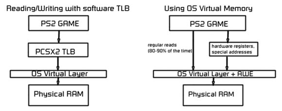

The Playstation 2 uses co-processor 0 to implement virtual paging. Even
without COP0, the Playstation 2 memory map is pretty complex and the
mapping can change depending on which processor you use to read the
memory from. A simple version of how the default mapping looks from the
Emotion Engine side is:

The 32Mb of main memory occupying 0000\_0000 - 01ff\_ffff
Hardware registers occupying 1000\_0000 - 1000\_ffff
VU/BIOS/SPU2 addresses in 1100\_0000-1fff\_ffff
Special kernel modes etc in 8000\_0000-bfff\_ffff
A scratch pad in some other address
...And of course can't forget the hidden addresses (thanks SONY)

To make matters worse, these mappings can change depending on the
setting of COP0. (Note that at the time of writing, Pcsx2 doesn't
emulate even half of COP0 correctly.) The simplest and most
straightforward way to emulate this is to have another memory layer
through a software Translation-Lookaside-Buffer (TLB). You pass it the
PS2 address, and out comes the real physical address or some special
code signifying a hardware register, etc. The problem is that **every
read/write** has to be preceded by a TLB lookup. Considering that
reads/writes are as common as addition, that's a lot of wasted cycles.

Well, the OS also uses virtual memory. In fact, every process has its
own special virtual memory driven by a real hardware TLB. If we could
get away by mapping the 4Gb PS2 memory map onto the process's virtual
memory, we could eliminate the need for the software translation (Figure
1). Looking at the virtual manipulation functions Windows XP offers,
there are two major problems with this:

1 WindowsXP reserves more than half the address space for OS specific
stuff. A good amount is also reserved for all of Pcsx2's working memory,
executable code, and plugins (especially ZeroGS). It looks like we are
left with less than 1.5 Gb of address range to implement the 4Gb PS2
memory map. Note that this problem doesn't exist on 64bit operating
systems where the address range is practically... infinite (don't quote
me on this 20 years down the road).

2 Playstation 2 allows more than one virtual page to point to the same
physical page, Windows XP doesn't (I don't know about Linux). Assume
that PS2 address 0x1000 points to the same physical page as address
0x0000, each page is 4Kb. Now a write occurs at 0x1000. The game can
retrieve that same value just by reading from 0x0000. In Windows XP,
this has to be two different pages; so unless some clever
solution/technology is discovered, we could kiss our VM dreams
goodbye.

The first problem was solved somehow by introducing special address
transformations before a read/write occurs.

And thankfully a clever technology presented itself for the second
problem: **Address Windowing Extensions** . This lets Pcsx2 handle the
actual physical page instead of a virtual page. We still can't map two
virtual pages to the same physical page; however, what we can do instead
is switch the mapping of the physical page as many times as needed! To
achieve this, Pcsx2 hacks into the root exception handler and intercepts
every exception the program generates. Whenever an illegal virtual page
is accessed (ie, no physical page mapped to it), Pcsx2 gets a
EXCEPTION\_ACCESS\_VIOLATION then it remaps the correct physical page to
that empty virtual page and returns. Although I haven't calculated
precisely, I'm pretty sure that switching physical pages around is
pretty expensive, computationally speaking. So all this works fine under
the assumption that game developers won't be crazy and access two
virtual pages mapping to the same physical page back-and-forth
frequently... \[pause\].

Alas, we were wrong... again (see floating-point article). It turns out
that there are uncached and cached address ranges; so it is optimal to
do such a bi-mapping trick: write in one virtual range and read from
another. Pcsx2 tries to detect such cases and work around, but there's
no clean solution.

And I'm going to stop here before this becomes a book.

So the ultimate question is: why doesn't VM work on some computers with
1Gb of RAM and the newest updates, while works on others? Turns out that
real-time monitoring applications like to take up some of the 1.5 Gb of
left over addresses on certain processes. (this might be OS specific
programs too). I have also observed that performance/debugging monitors
like NvPerfHud do similar tricks. There probably might be other reasons
for VM builds of Pcsx2 not working because virtual memory is a pretty
complicated issue.

**Moral of the blog** Read an OS book. I recommend [**Operating System
Concepts**](http://www.amazon.com/gp/product/0471694665/ref=sr_11_1/102-0719927-1309710?ie=UTF8)
(the dinosaur book) by Abraham Silberschatz, Peter Baer Galvin, Greg
Gagne.
