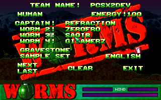

**PCSX2** is perhaps one of the few projects that releases a constant
series of videos demonstrating development progress, and whilst I'm not
100% sure on this, I believe the only emulator to have had two "promo"
videos demonstrating that yes indeed, PS2 emulation is possible!

These videos are delivered to you via **Bit Torrent**, which for an emulation
site is somewhat unique. In fact so "odd", I've had emails asking me if
the use of Bit Torrent is legal, surprisingly Bit Torrent can and is
used for legal distribution!

You might wonder why such "promo" videos are made, it's somewhat
unorthodox, well aside from the fact they are good fun to make, they
serve to demonstrate what this project is doing as many people still
don't believe that this is even possible!

How are these videos made? Simple!

When using *zeroGS* you merely have to press **F7** to start recording
to your preferred codec, you then press F7 to stop recording, at this
point you can just quit the emulator and marvel at your video, or you
can keep playing! Press F7 again to add more footage to your video, and
again press F7 to stop recording, this will produce one video based on
where you stop/start recording.

*zeroGS* automatically speeds up footage to "normal" speeds, which
causes issues if you want to record audio in sync with the video
footage. *P.E.Op.S SPU2 DSound Driver* records at "emulated" speed and
if the recording was muxed with the video recording, it would be
significantly out of sync.

However, you can get around this issue by disabling MTGS / DC modes from
the CPU settings dialog, and setting *P.E.Op.S SPU2 DSound Driver* to
**Thread Mode** . To *ensure* sync with the video, set *P.E.Op.S SPU2
DSound Driver* to start recording **before** you confirm the codec you
wish to record with.

You then can put the audio and video streams together in your preferred
video editing software, for simple tasks like this I recommend
[VirtualDub](http://www.virtualdub.org/) .

The ability to record video directly from a PS2 game has significant
benefits over camcorder or TV card recording as you can get fantastic
quality at higher resolutions than the PS2 can natively output.

For the gaming enthusiast it lends itself nicely to demonstrating how
kick-ass you are at a game, or lets you demonstrate secret areas,
advanced combos.

[YouTube](http://www.youtube.com) obviously offers a space to share such
videos, and many people from all over the world already show fantastic
videos from PCSX2, even the team use YouTube as a low bandwidth option
to our high quality torrented videos.

[YouTube](http://www.youtube.com) is also used by some testers to
demonstrate intermediate work, and this videos are normally only shown
on the [official forums](http://forums.pcsx2.net) as a bonus to our
forum browsers, an example of this would be the following video
demonstrating *Final Fantasy XII* no longer suffering from vanishing
text

<!-- TODO - embed video links were lost! -->

So go on! Search [YouTube](http://www.youtube.com) for "PCSX2" and check
out what our users are posting! I personally get a great deal of
pleasure from seeing this emulator being enjoyed and used.

If you feel inclined why not record your awesome combo powa's, or you
defeating some insanely tough boss and then place them on
[YouTube](http://www.youtube.com) .

If something catches our eye, you may just get a honorable mention here!

**Latest Development Video - Kingdom Hearts II**

**Resident Evil 4 - Pervert (RPGWizard)**

**FFX-2 Secret Ending (NexXxus86)**

**PCSX2 Developers 0 - 1 Betatesters**
Nothing to do with PCSX2, but testers RULE KTHX! HIHI

