Work has been silently progressing over in camp PCSX2. So whats going
on?

Well for starters PCSX2 **linux** . Development for PCSX2 linux has gone
extremely well, so well in fact that several games already run on the
developers machine and soon we betatesters shall be entering mainstream
testing phase.

With the advent of PCSX2 linux comes zeroGS **OGL** , a full port of the
current D3D zeroGS by zerofrog. Whilst this OGL port is in terms of
visual compatibility is extremely close to the D3D build, it has several
speed related issues to 'iron out', of course these issues will be fixed
in the future, and more information shall be given out soon. There will
also be a 'surprise' with zeroGS OGL, but that is for zerofrog to
announce in the future!

PCSX2 is also getting a full blown **x64** build! This is some
exceedingly hefty work, with x64 recompilers and core having to be
written. Such a port will be able to take full advantage of x64
compatible CPUs under an appropriate OS (Windows x64 / Linux x64), this
should offer **significant** gains in speed, however the work is
preliminary and we can't offer direct examples or comparisons yet..!

To all those who have donated, thank you very much! Your donations have
helped us buy new hardware to fully develop the linux ports and use
64bit in a stable environment.

Of course with all this porting and rather complex set of additions
doesn't leave huge amounts of room for the team to work on other
aspects, but we have not forgotten the primary reason for this emulator. Getting PS2 games to run on your PC, and compatibility thus has
**not** taken a sidestep, below are shots of **Soul Calibur II** running under a recent beta of PCSX2:

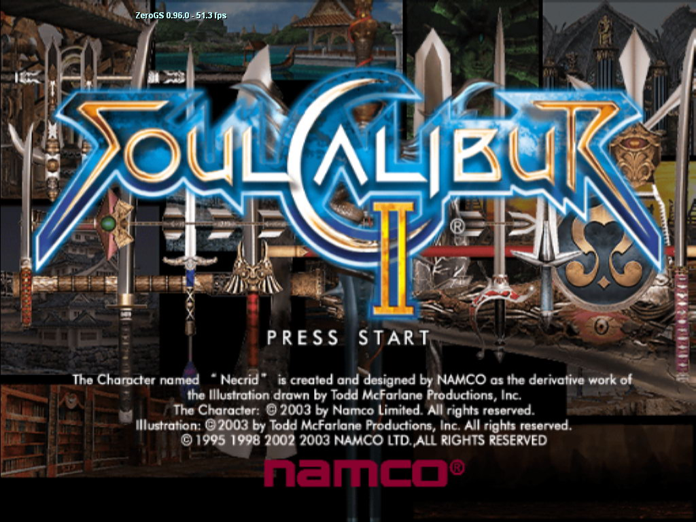

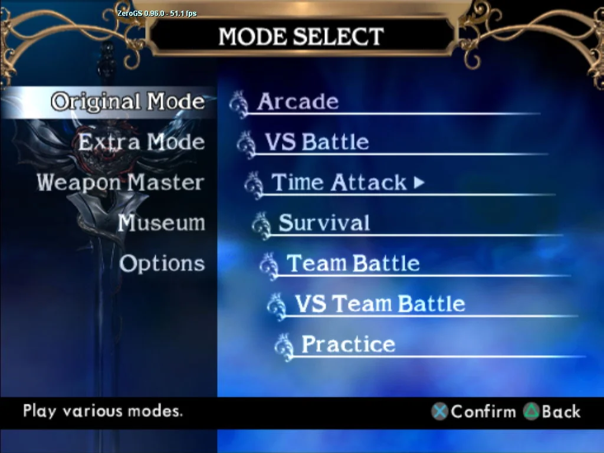

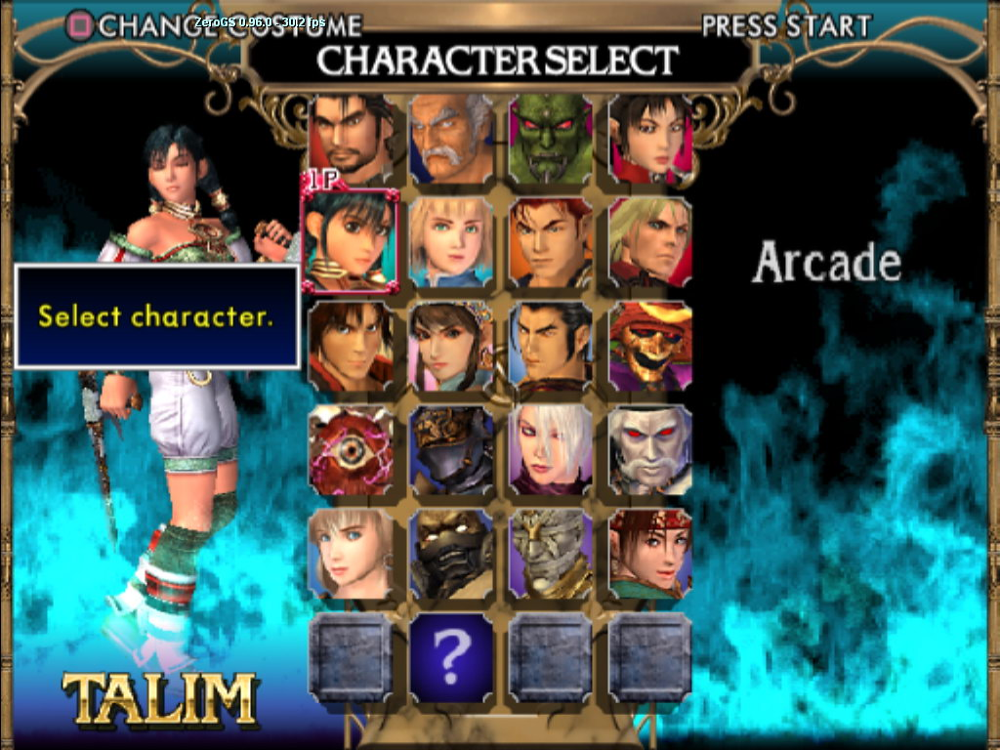

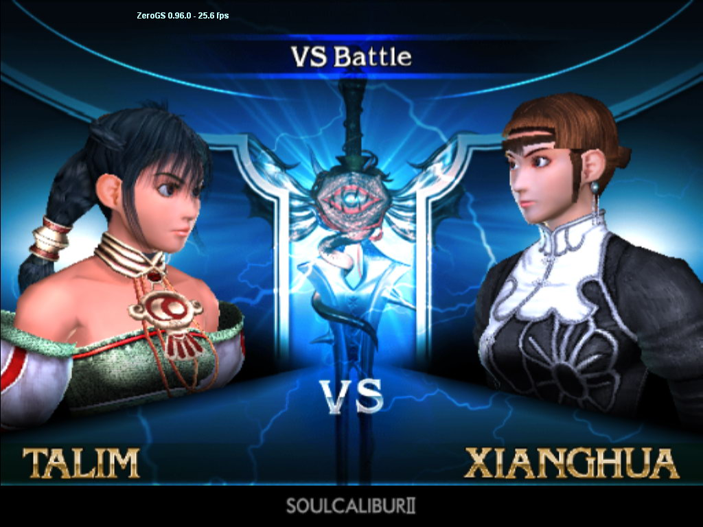

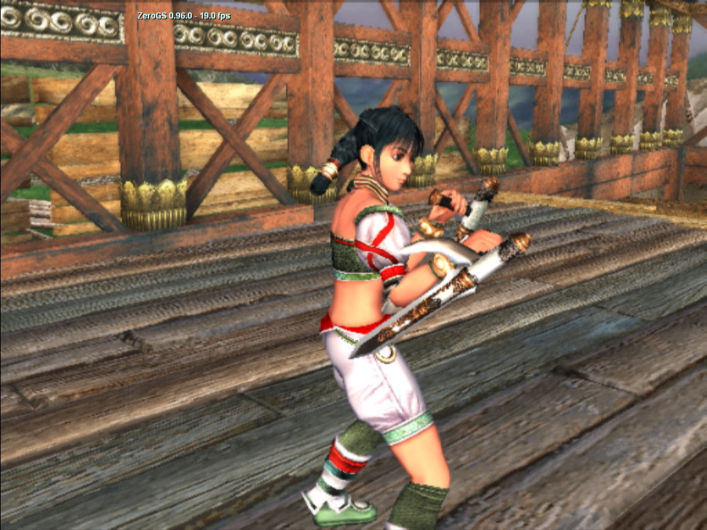

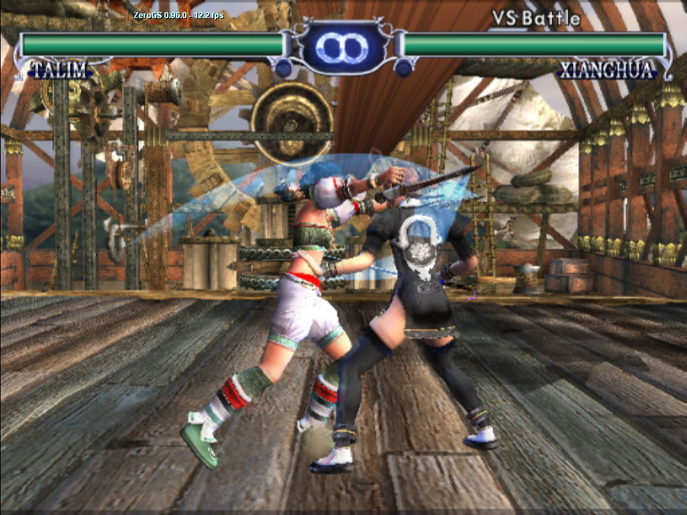

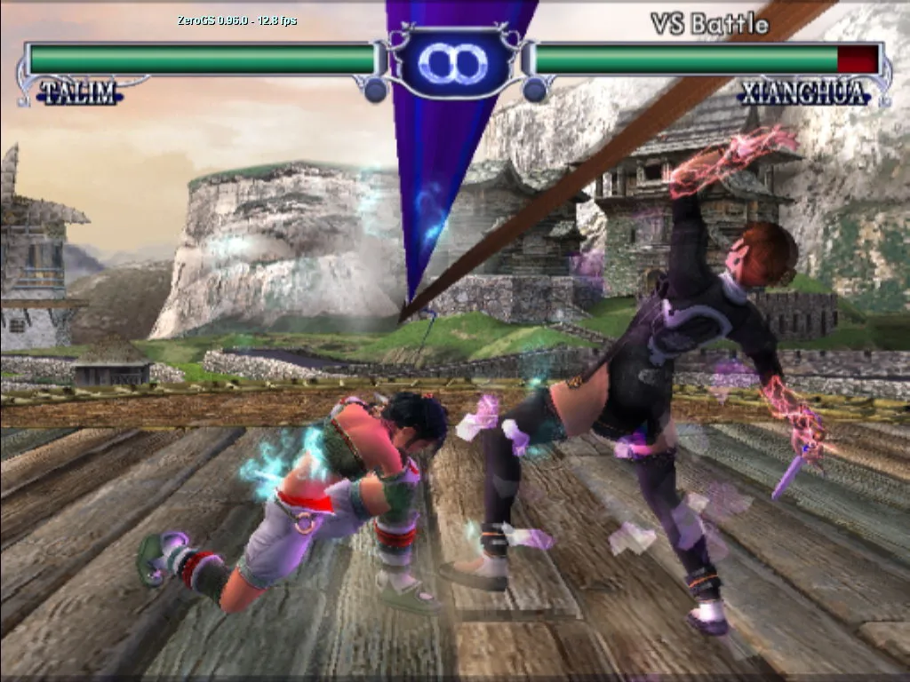

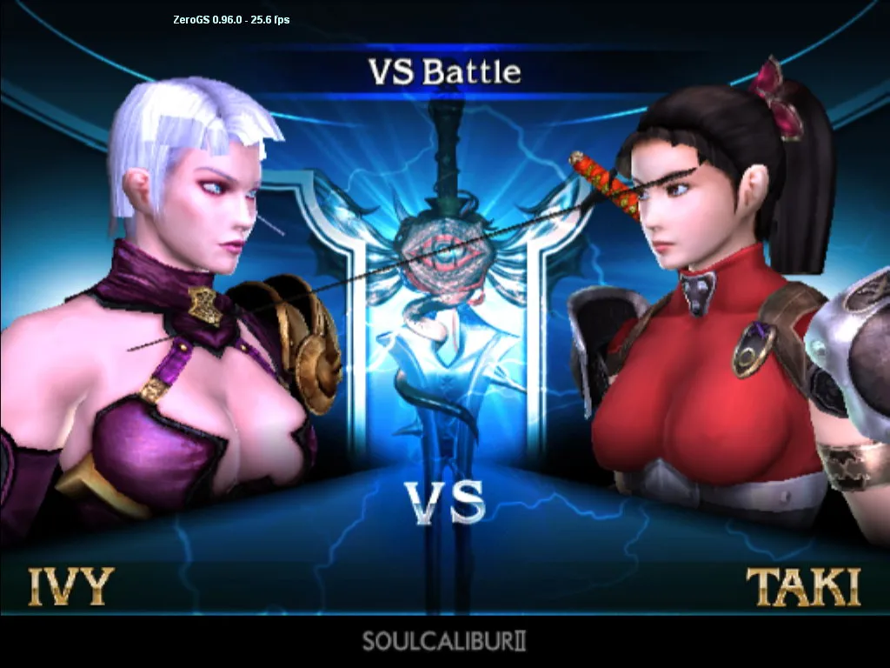

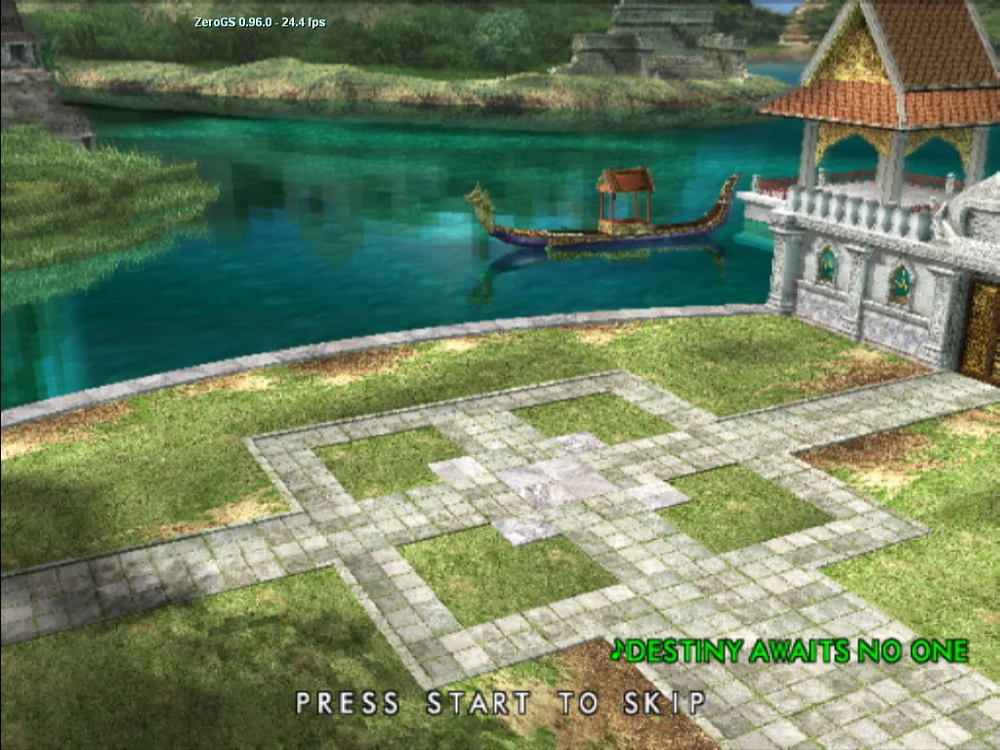

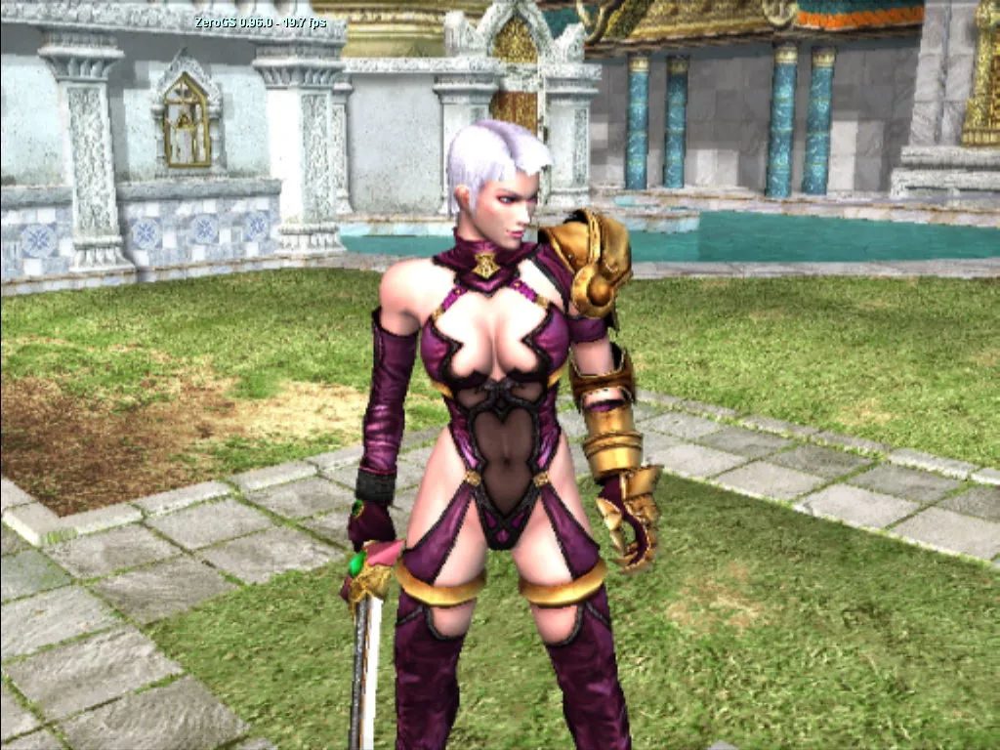

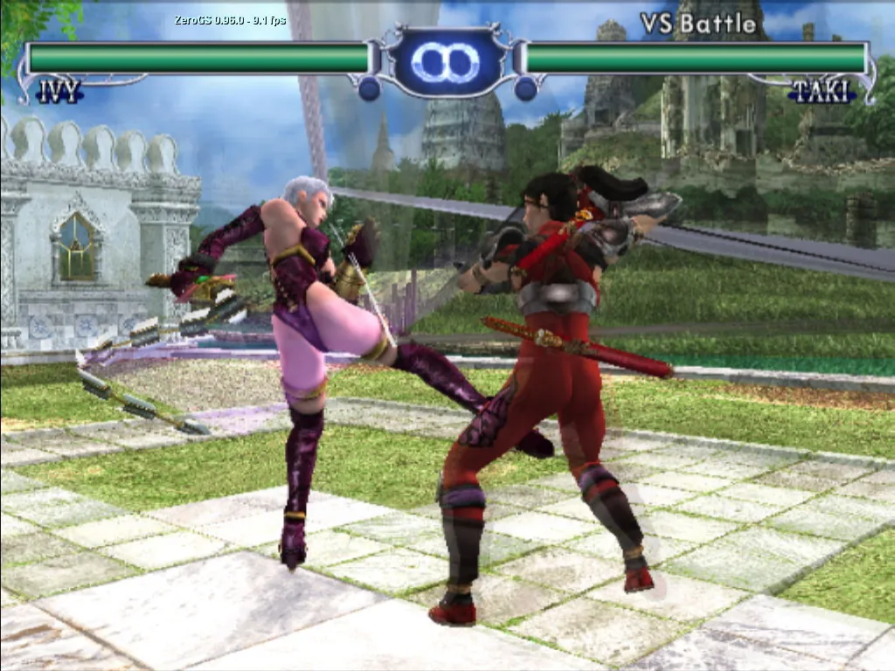

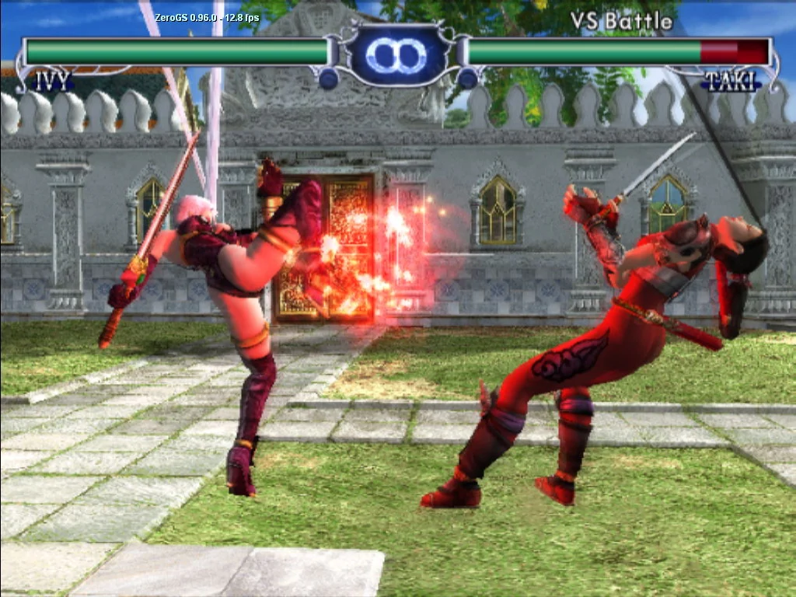

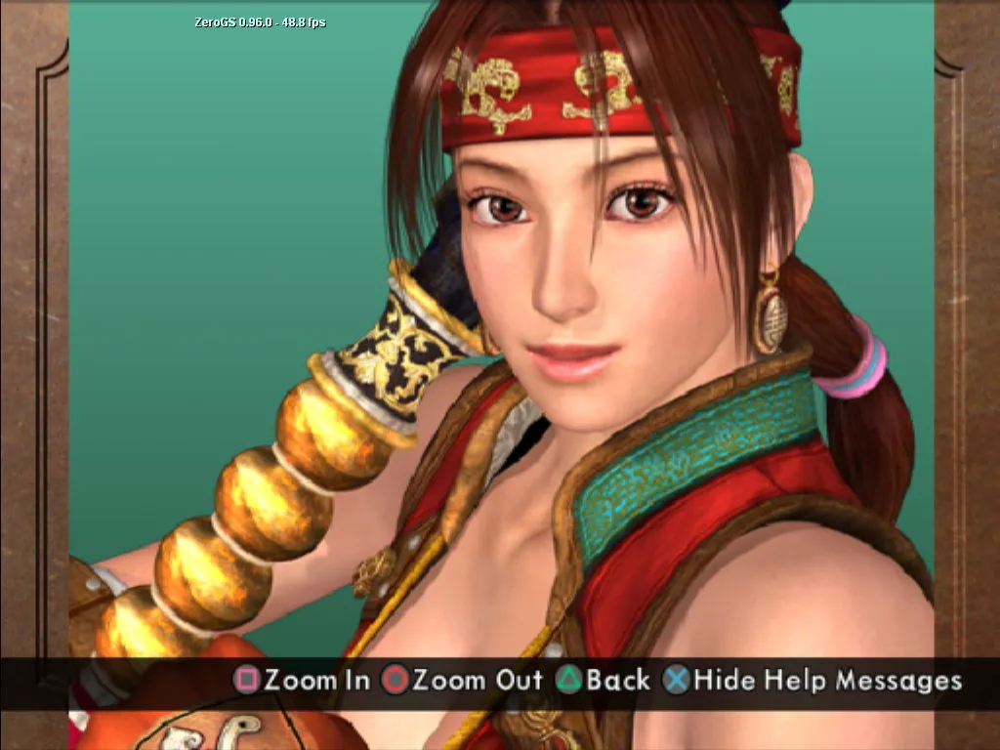

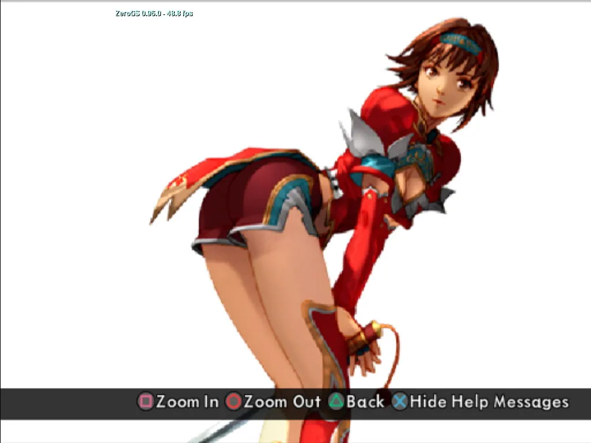
