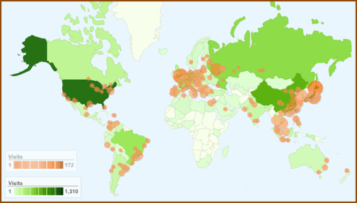

Wondering about who's watching as we make and break bleeding edge
alpha/beta versions of PCSX2? I do! Here's a map representing the visits
to our SVN repository at Googlecode,
for the past 2 weeks.

<!-- TODO - legacy -->

On average, our SVN totals per day:

-   900 unique viewers
-   3,200 visits (3.5 visits per viewer)
-   9,500 page views in total.

Top visitors by city:

1. Sapporo 171
2. London 165
3. Tokyo 151
4. Shanghai 147
5. Moscow 142
