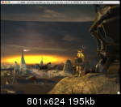
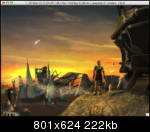
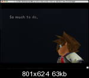
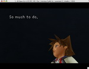

It's that time of the year again, so i had some time to work on pcsx2/mac, now with nice sound as well.
😉 This update is about solving the missing
textures problem that has been plaguing pcsx2/mac for ages.

Zerospu2 0.4.6 has been ported to mac using cross-platform Portaudio
library, i recommend all users to use it
😊

Zeydlitz has recently worked on z-buffer swizzling for the ZZOgl plugin
and this has fixed a lot of missing textures problems for us. I also
fixed some code in pcsx2 for ffx missing textures. Some shots:

**FFX**

VS

**Kingdom Hearts**

VS

