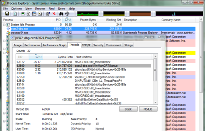

As most people probably know, PCSX2 is primarily a dual-thread
application. The two main threads are described as such:

-   EE/Core thread emulates the PS2's EmotionEngine (including VIF, SIF,
    GIF, and VUs) and the IOP (including SPU2, CDVD, and PAD)
-   GS thread emulates the PS2's Graphic Synthesizer (includes texture
    swizzling, texture filtering, upscaling, and frame rendering)

Each thread relies on the other thread in some way -- the GS thread
cannot swizzle texture data until the EE thread has uploaded said data,
for example. Meanwhile, the EE thread cannot upload texture data to the
GS thread if the GS thread is currently bogged down rendering last
week's frame to video. During these periods, either thread will *sleep*
, only to be woken up once the other thread has caught up in its
workload.

In theory the act of sleeping the EE/GS threads should make benchmarking
the CPU load registered by each thread pretty easy: all modern operating
systems have built-in APIs for reading the busy/idle time of any thread
on the system -- this is the same API used by your tried and true
task/process manager, for example:

*(Air shows off his personal favorite,
[ProcessExplorer](http://technet.microsoft.com/en-us/sysinternals/bb896653.aspx)
, part of the [SysInternals
Suite](http://technet.microsoft.com/en-us/sysinternals/default.aspx)
)*

This readout is simple, efficient, and seemingly reliable. It also
avoids a lot of the annoying pitfalls one runs into trying to use common
alternatives such as
[rdtsc](http://en.wikipedia.org/wiki/Time_Stamp_Counter) and
[QueryPerformanceCounter](http://msdn.microsoft.com/en-us/library/ms644904.aspx)
.

... and this is precisely the method I decided to use for PCSX2
0.9.7.r3113 (and still in use as of r3878). Simple theory really: if the
GS thread is sleeping a lot (low load) then the game is bottlenecked by
EE/Core thread activity. If the EE thread is sleeping a lot and the GS
thread reports 90+%, then the GS thread is the bottleneck (a problem
often correctable through using lower internal resolutions, for
example).

But as I've recently found out, it doesn't work as expected. -\_-

**It's filled with... threads!**

The immediate problem faced by this simple method of load detection is
that the latest wave of Windows Vista/7 GPU drivers themselves ***are
multithreaded*** . It should have come as little surprise that one of
the primary goals of the new DWM/Aero/DX11 systems implemented into
Vista/7 is scalable parallel processing that takes better advantage of
modern multi-core CPUs. Why this causes the OS built-in thread load
detection to fail might be less obvious; I'll explain with an example:

When the GPU driver receives a directive to render the current scene
(aka 'Present' in DirectX lingo), it sends the job to a thread dedicated
to the task. That thread has a *Present Queue* , typically 1 or 2 frames
deep, that automatically handles triple buffered vsync'd page updates.
If the queue is full when the PCSX2 GS thread issues its next Present
request, the **GPU driver will put the GS thread to sleep** until a slot
in the Present Queue becomes available. End result: The GS thread
reports idle time to the operating system (and to PCSX2's GS window),
but the GPU is still quite overloaded and bottlenecked via work supplied
to it by a different thread altogether.

In essence, it is nearly the same sort of inter-thread dependence that
the EE/Core and GS threads have between each other, only now the EE/Core
thread's dependency chain extends to include GS *and* GPU driver threads
(of which there could be one or many).

The solution to this problem is to use a more traditional method of
manual load checking: timing various sections of code executed in-thread
via either the aforementioned rdtsc (timestamp) or
QueryPerformanceCounter, read at key points in the GS thread's
execution/program flow. This wasn't such a great idea a few years ago,
due to K8/Athlon and P4 generation CPUs lacking a stable internal clock
counter. Fortunately, all modern CPUs have a consistent counter suitable
for benchmarking, so the pitfalls that have been long associated with
using Intel/AMD timestamps are finally obsolete enough to not be a
concern for us here.
