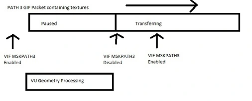

I promised myself ages ago I would write a blog about this, more for the
PS2 community than anything else as this seems to be almost a dark art
in terms of understanding how it works.  
  
Some of you may be familiar with Path 3 masking, some of you may not. In
any versions around 0.9.4 or older, have you ever played a game where
say some of the floor textures have had writing on them or just looked
like absolute crap? Well the likelihood is that was due to Path 3
Masking problems. For those not familiar, here is a picture example of
Persona 4 displaying Path 3 masking issues.  
  

  
**So, what is it exactly?**  
  
Path 3 masking is a method of synchronizing the order in which geometry
data (polygons etc) and the textures that go on them are sent to the GS
(Graphical Synthesizer). It was a pretty efficient method of
transferring information, which took completely different path routes to
make optimal use of the PS2 Memory BUS and used a stalling method to
keep the texture and geometry lists in order instead of interrupts which
took extra cpu time. This way, developers could queue up massive amounts
of textures and stream them to the GS in time with the geometry data
efficiently.  
  
Here is a badly drawn diagram showing what the Mask does:  
  

As you can see, the mask stops PATH3 from transferring while the VU is
busy, then lets it go and almost immediately puts the mask back on, this
ensures that at the end of the texture transfer, PATH3 stops again!  
  
**So what was the problem? Why did everything look like crap?**  
  
Truthfully? we never had proper control over these packets. The GIF
packets can come through the PATH3 DMA channel lumped together, where in
actual fact, we should have been stalling half way through it, but in
the emulator, we didn't really care what these packets were, so we just
threw it all at the GS and ignored any packet ends and this is what
caused the Texture/Geometry lists to go out of sync, this is where the
crap on the screen came from. As the emulator evolved it became
progressively easier to fix this issue, although we had the theory down,
developers would handle it in different ways with different timings for
the masks, so it took a fair amount of testing and tweaking to get
right.  
  
Fortunately these days we have got this pretty much solved and we
completely analyze the GIF Packets before sending them on their way, so
we know where we can stop the transfers, however we do still get the odd
time where this rears its ugly head, due to how we have to time
everything perfectly, but due to the nature of emulators, timing is
painful to get correct and will probably never be so. Generally however,
using gamefixes such as "EE Timing Fix" can get around these issues,
without compromising too much on stability.

**[Post a Comment!](https://forums.pcsx2.net/thread-24047.html)**
