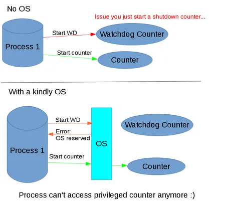
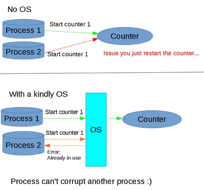
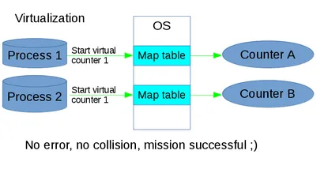
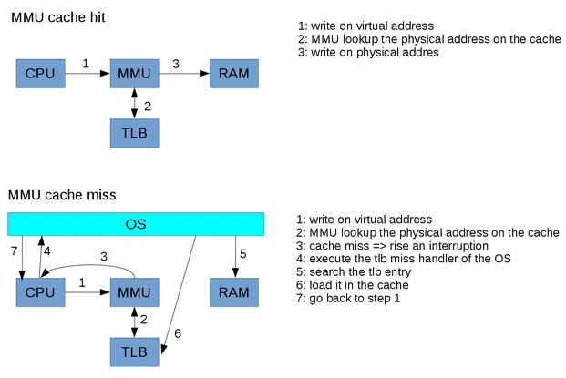

Hello PCSX2 followers,

It's been a while since the last developer blog entry. I would like to
resume this old tradition.

I will present you a mini series on the MMU (memory management unit) and
virtual memory. Jake and ZeroFrog already wrote some posts relating to
this topic:
- [So Maybe It's About Time We Explained Vtlb](/blog/2009/so-maybe-it-s-about-time-we-explained-vtlb/)
- [Virtual Memory](/blog/2006/virtual-memory/)

This time, I will explain the goal of MMU and why it is mandatory for
modern systems. The MMU is a cornerstone for stability and security. I
will also explain why it could be costly for the performance on the
native system.

On the next article, I will present you the PS2 address space and how
the MMU is really used.

Let's begin with the root, the Operating System (OS). Hardware can run
without any OS but it is often a necessary evil. The OS has 2 major
goals:

1/ The first goal of the OS is to control privilege access of
processes.
Maybe you want to keep a resource for the hardware or OS internal, for
example a hardware watchdog. Maybe you only want to check the validity
of a command. It could be as simple as only allowing a stop command
after a start command.

Let's see a basic example: starting some hardware counters

As you can see, without any OS you could easily kill your system. The OS
allows the separation of privileged and standard resources.

2/ The second goal is to share the resources between processes
You need to understand that processes are independent for coding
simplicity and security.
Let's reuse our hardware counter example

------------------------------------------------------------------------

This time we want to start the same counter from two different threads.
Unfortunately process 1 will be corrupted by process 2. It's pretty bad,
process 1 will likely crash. Again the OS is the solution. It replaces
the corruption with an error that can be handled by the process.

Concluding this mini presentation, the OS is the gatekeeper of the
hardware. The OS is a real god but be aware "with great power, comes
great responsibility". System stability depends on the quality of the
OS. On the contrary the process is isolated. A bad process will die
alone, yes life is tough.

Now let's talk about virtualization. In our 2nd example, the OS throws
an error because the counter is already used by another process. However
our system can support several counters, it is a shame to wait for the
first counter to be available. The process wants to start a counter, it
doesn't care which one. So it might be possible to handle this situation
better. The solution is virtualization.

Here's the idea, let's create a pool of virtual counters by process and
then the OS will remap them to a real physical counter. As a bonus, we
don't need to limit the number of counters based on the hardware. You
can have 10 virtual counters for only 2 physical counters.

Let's redo the previous example with a virtualization layer in the OS.

As a side note, virtualization is a common solution for resource
management. On the internet you have a logical IP address instead of
using the Mac address directly. HDD access can be virtualized too with a
tool like LVM
<http://en.wikipedia.org/wiki/Logical_Volume_Manager_%28Linux%29> .
Sometimes the whole machine is virtual, see VirtualBox or even PCSX2.

------------------------------------------------------------------------

The hardware counter was an example but the subject of the blog is the
MMU so let's get back to virtual memory. And yes you got it right,
virtual memory is the same concept as we discussed earlier. The process
will access virtual memory. The OS will translate it to the physical
address.

I said that the OS will remap the virtual memory to physical memory but
that is not exactly correct. Memory access is very common in a process,
let's say every 2 or 5 instructions. Imagine if the kernel did a lookup
of the physical address every 4 instructions, it would be slow as hell.
Actually it is even worse because the program counter (PC) is also a
virtual address. Software is deemed to be slow, it needs to be hardware
accelerated.

Here comes the MMU that allows the CPU to do the conversion on the fly.
The MMU uses a dedicated cache named TLB (Translation Lookup-aside
Buffer). However a hardware cache is very costly, you can't store a
physical address for each logical address, besides remember that the
virtual memory could be bigger than the physical memory. So the memory
address space is split in pages, often 4K but various CPUs can support
several page sizes. The PS2 supports 7 sizes of pages from 4K to 16MB.

A TLB miss will cost you hundreds of CPU cycles and for good reason, a
4GB virtual space requires 1 million table entries of 4K-pages. A common
trick to reduce cache misses is to increase the page size so you can fit
"more memory" in the TLB cache. However there is a terrible issue, the
waste of resources. One page is an atomic resource, that means either
the page is free or the page is locked by the process. If the process
allocates a single byte on a 16MB page, nearly 16MB is lost for other
processes. It's not a real solution for the PC which uses hundreds of
processes but that is very different for the PS2. We will discuss this
next time.

See below a typical use model of the MMU:

The MMU is a nice and complex solution to handle memory access. But
there is more. You can attach some flags to each page. For example on a
modern PC, you have readable/writable/executable. The PS2 doesn't
support all those flags, yes it's not modern anymore, however it has
another class of flag that controls cache behavior: cacheable/uncached
accelerated/uncached. Note for completeness sake that the PS2 also has
read only flags. It is a powerful mechanism but we will discuss the
implications on the next chapter.

Mini quiz:
\* The first 512KB of RAM is not virtually mapped because it is at the
location of the OS, do you know how the kernel will access this
location?
\* A hardware component needs to access the memory without the CPUs
intervention. Do you know which one? Do you know how the addresses are
handled?
