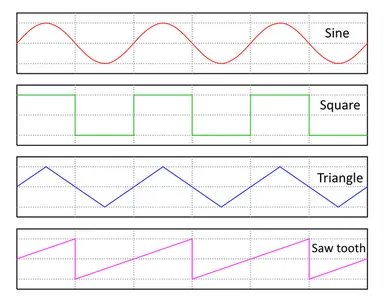
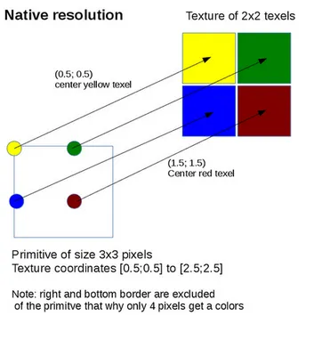
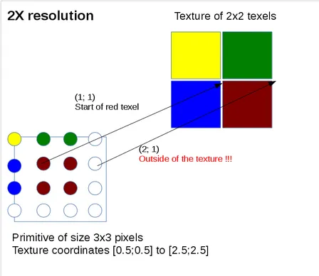
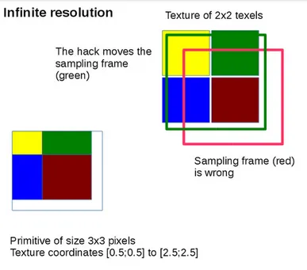

First, let's explain aliasing and why people are so keen on removing it
with anti-aliasing. Let's start with some math

In the real world, signals are often "continuous." If you take two
points A and B and A is very close to B then F(A) is very close to F(B).
But a screen is not continuous. If you take two pixels side by side, one
can be white while the other is black.

Typical example of some continuous/discrete signals:

It is very easy and accurate to transform a continuous signal into a non
continuous signal. You just need to sample it, i.e. take a subset of
values. It is often used in computer science to reduce the quantity of
information compared to the original signal. Otherwise it simply
requires to much power to process it.

The thing is that later, when you render it, you need to do the reverse
transformation. Human senses expect continuous video and sound. The
transformation above is very easy, but this time things are much more
complicated. If you need a value exactly at a sample point - it's fine,
you have it

But what happens if you need a value that is between two samples? It
doesn't exist, so you need to create it. This is called aliasing - any
random value is an alias of the original value.

The purpose of anti aliasing is to predict a value between samples that
is as close as possible to what the original value would have been by
using the samples that you do have to estimate what is missing.

For example, let's imagine that sample 1 is white and sample 2 is black.
What will the value of a pixel between sample1 and sample 2 be? It could
be white or black (Nearest filtering.) It could be a mixture of both, so
gray (Linear filtering.) Note that nothing prevents the true value of
that pixel from being red, blue, yellow or anything, but it is
impossible to predict that based on the data we have.

Let's get back to GS emulation now.

Primitives sent to the GPU/GS are continuous. For example, you ask the
GPU to draw a triangle, not to draw N pixels. However due to limited
resources, your GPU will only compute the colors of N pixels on your
screen/framebuffer. The rendering will be exactly the same as if you had
asked the GPU to draw N pixels in a triangle shape. Nobody will see the
"holes." However, if you increase the frequency of the sampling (i.e.
use a bigger resolution) you will see those holes. If your screen had
infinite resolution you would be able to see that the rendering is
various points shaped like a triangle - not a real triangle.

The PS2 does something similar. It sends various rectangles that fill
the screen, but they have holes. Due to aliasing you never see them at
native resolution. Upscaling however increases the frequency of sampling
because it is "emulating" a higher resolution output. As with the
previous example, the holes become visible. In the case of Namco games
they manifest as black vertical lines.

In other words, when upscaling, the emulation of the GS is more accurate
than the real GS that the PS2 has. Unfortunately, humans don't like
their images full of pointless black lines. So to fix it, we added
another hack. The hack will detect rectangle primitives that are too
small and then extend them half a pixel to fill the hole. It does the
job well and it doesn't impact speed much.

Now let's explain the other new hack. Primitives have only color
information - this is enough for a small surface but not efficient to
draw a big surface. In order to reduce computational load they just map
a texture on to the primitive. You just need to provide the texture
coordinates. Instead of a lengthy explanation, let's just use an
example.

As you can see in the picture, you will sample an invalid value at 2x
resolution. Generally games use a texture atlas so you inadvertently
sample from the next texture. This is quite noticeable on font textures.
The idea of this hack is to shift and round the texture size to better
fit the intended behavior of the game. There are various corner cases so
it is difficult to have something both fast and accurate. Many games are
better but they're not perfect.

The hack also disables extra linear filtering. Globally the upscaling
issue is caused by a texture that is too small. This was likely done on
purpose to reduce memory usage (PS2 video memory is only 4MB, compared
to multiple gigabytes that we have today). Linear filtering allows
interpolating a color based on the texels around it. But it requires
that those texels exist

So textures need to be one texel bigger than they are for linear
interpolation. We don't have that possibility, unfortunately.

In conclusion, native resolution works because of aliasing issues. The
holes and errors in the image are below the sampling rate of the PS2's
traditional output and therefore you never see them. Once you enable
some form of anti aliasing (linear filtering/upscaling/MSAA/\*\*AA),
they become visible as the sample rate is high enough to expose them.

Proofread and corrected by [Blyss
Sarania](http://forums.pcsx2.net/User-Blyss-Sarania)
