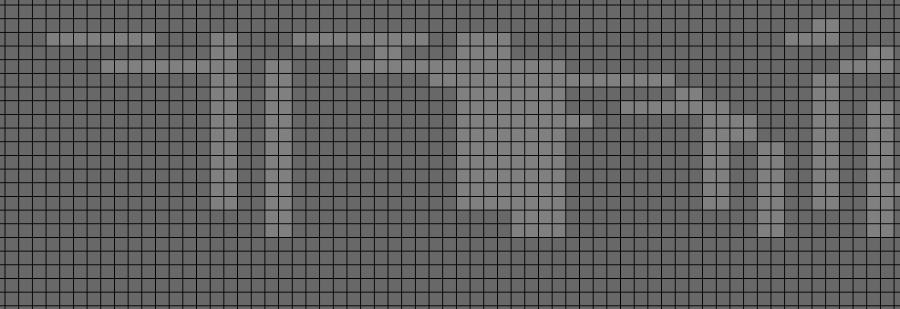
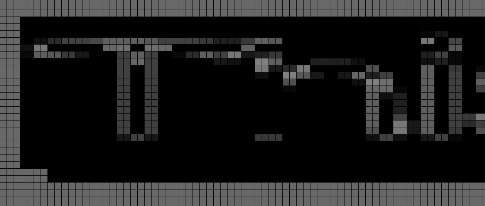
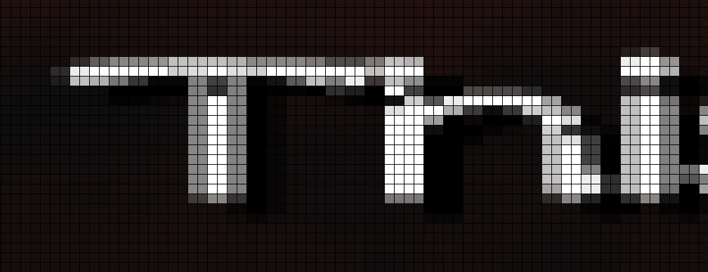
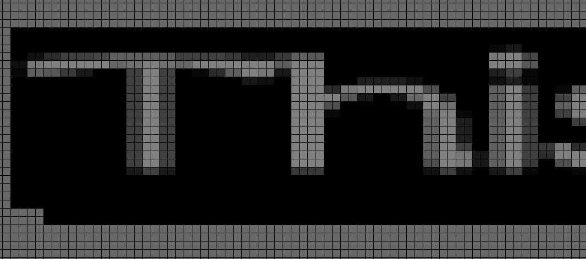
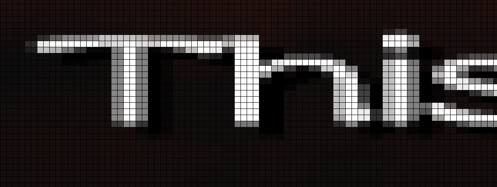

Today, we will discuss the alpha testing feature of the GS. The feature
is very basic but awful to emulate. Yet again, GS capability is 10 miles
ahead of current GPUs.

Let's first look at the graphics pipeline to understand what alpha
testing is. The main purpose of the graphic rendering pipeline is to
compute thecolor of a pixel. But the color isn't enough if you want to
render a 3D scene. Standard renderers use a Z-buffer, also called a
depth buffer. They are based on a pixel test (note: they ought to be
called fragment tests). It is really easy; If the test fails (pixel is
rendered behind the current one), you discard the color depth value. If
the test passes (pixel is rendered above the current one), you update
both, color and depth values.


In order to allow special effects, extra pixel tests were added to the
graphic pipeline, alpha testing is one of them. This time, instead of
testing the value of the Z buffer, it will test the value of the alpha
channel (aka transparency) of the fragment.

Newer GPUs don't havea hardware unit to implement this feature anymore.
But it can be easily implemented in the fragment shader. Not a big
deal.

Here is an example of GLSL code:

```cpp
if (fragment.alpha > alpha_reference)
  discard;
```

Everything is fine but there is a subtlety; On the GS you can only
discard either the color OR the depth. Whereas modern GPUs will discard
both, color AND depth. Argh...

Gabest implemented a 2 pass shader to handle it. First pass will only
process the pixel that passes the alpha test and update both color and
depth. That's easy, no complex discarding. The second pass will process
the pixel that failed the alpha test. The color (or depth) write will be
masked and only the depth (or color) will be kept. In other words, you
need to split in 2 fragments that are partially discarded.

It works fine (except for the performance impact of using 2 draw calls
to handle a single draw) for most games. However some games don't like
it, such as Burnout or Gran Theft Auto.

Note: the example below is a special case of alpha testing. Alpha
testing can be configured in multiple ways on the GS. You can control
the alpha test operation but also the part that will be discarded.

## The nightmare

So what happens is that the above reasoning of the 2 pass shader seems
correct but it is based on the assumption that color and depth pixel
operations are commutative. For example, a good case is a blending
addition: Color Final = Color Source + Color Destination. You can
process pixels in any order. However the reverse subtraction (Cd - Cs)
blending isn't commutative.
Let's take an example.
Color initial = 0
Color fragment1 = 30
Color fragment2 = 100

Addition C1 then C2 =&gt; Color Final = C2 + (C1 + C0) = 100 + (30 + 0)
= 130
Addition C2 then C1 =&gt; Color Final = C1 + (C2 + C0 )= 30 + (100 + 0)
= 130

R-Subtraction C1 then C2 =&gt; Color Final = C2 - (C1 - C0) = 100 - (30
- 0) = 100 - 30 = 70
R-Subtraction C2 then C1 =&gt; Color Final = C1 - (C2 - C0 )= 30 - (100
- 0) = 30 - 100 = -70 (which will be clamped to 0)

Now that blending is explained, we can go back to the Burnout / GTA
games. Bingo, those games use operations that aren't commutative. So the
previous 2 pass shader doesn't work.

Some info on the Burnout bad draw call
\* Depth test: greater or equal
\* Alpha test: discard depth if alpha greater than AREF
\* Blending equation: C = Alpha Src \* Color Src + (1 - Alpha Src) \*
Alpha Destination

Screenshots (of the game Kengo, but it is the same) can be found at the end of the blog

## A solution

Color isn't commutative. Neither is Depth... Too bad. Looking further in
the primitive in that draw call, I noticed that the Z value is constant
at 0xFF\_FFFF. It is the maximum value of the 24 bits depth buffer. In
other words, depth tests are always passing as it will always be greater
or equal than the current value. So the depth test could be replaced by
always true. As a bonus, it allows a small micro optimization of the GPU
work. However, it is interesting to note that the depth test operation
is now commutative and can be executed in any order.

Now let's look further to the alpha test, only the depth value depends
on the alpha test results. Colors will always be computed as the depth
test will always pass. So we can implement a new way to emulate the
alpha testing. As previously mentioned, the goal is to avoid partial
discards.

First pass will process all the colors with associated blending. Second
pass will process the depth value. First pass doesn't depend on the
alpha valueanymore so it is easy to emulate. Second pass will mask all
color writes. Depth writes will be discarded when the alpha test fails.
As you can see, you don't have any partial discards anymore. The result
is accurate because it doesn't depend on the depth test anymore, due to
the previous optimization.

## Looking further

Debugging the trace log further, I found another opportunity to optimize
the alpha test. Alpha tests are free on the GS, so I suspect some game
designers forgot to disable it even if it is useless. Sometimes alpha
testing is enabled but there isn't any depth buffer to use it with. In
this case alpha testing is useless because all depth writes are already
disabled. So we have another opportunity for a new micro optimization.
We'll do a normal rendering in 1 pass with a lighter shader when alpha
testing is useless. It is really a minor optimization but it comes free.
We all like it when it is free

Looking even further, it would be possible to rely on some undefined
behavior of openGL to implement partial discards. For example, we can
force the depth write before the execution of the fragment so a discard
will keep the depth. It won't help here but it could help for other
alpha test issues. More tricks will be possible with future hardware,
however I don't know the performance impact.

## The conclusion

To conclude, alpha test emulation isn't nice on current GPUs. It
requires multiple shader passes, which impact performance. And worst of
all, it isn't accurate. Let's be honest, the new improvement barely
solves any issues. But it is better than nothing. It fixes the text
rendering in some games without any speed impact. And the extra
optimization will reduce the GPU workload on some draw calls. It's rare
for us to be more accurate and faster simultaneously. Now you can enjoy
beautiful text rendering in God of War, Grand Theft Auto, Kengo,
Burnout, Stuntman, HSG4 and hopefully more.

## Some screenshots of the alpha test issue


Here is an example of the rendering of letters.

\* The alpha channel rendering of the old code after the 1st pass


\* The alpha channel rendering of the old code after the 2nd pass (yeah
awful)


\* Now the color channel after the 2nd pass (notice the various holes
due to wrong alpha blending)


\* Finally the alpha & color channel of the new code (alpha is much
nicer and the letters as well)



