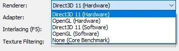
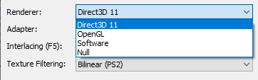
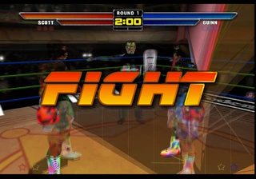
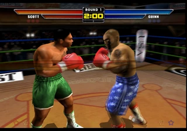
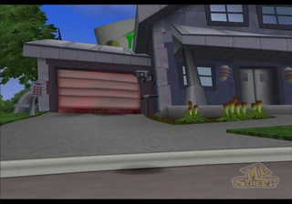
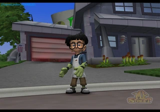
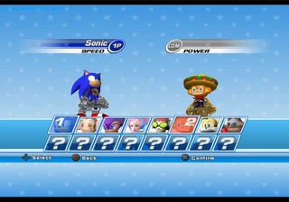
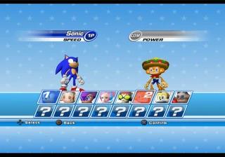
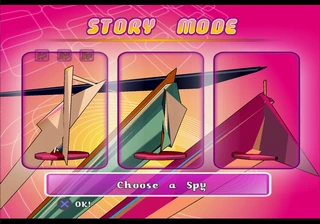
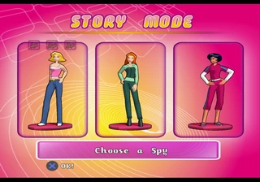

## [Q3 2020 Progress Report](/296-q3-2020-progress-report.html)

On the previous report the highlight was GSdx improvements mostly. This
one on the other hand is Core changes, and A LOT of core changes. Enjoy!

Written by
[lightningterror](https://forums.pcsx2.net/User-lightningterror)

# GSdx Improvements

 \[Accuracy Enhancement\] 
**[\#3507](https://github.com/PCSX2/pcsx2/pull/3507) (Direct3D10/11 HW)
SetupIA, allow sprite conversion to be done on the CPU when
applicable.Port from OpenGL. By
[lightningterror](https://github.com/lightningterror) .**

-   Helps sprite rendering inLets Make a J-League Pro Soccer Club (see
    image comparison below).

Before

After

 \[Misc Enhancements\]  **Other
GSdx changes:**

-   [\#3508](https://github.com/PCSX2/pcsx2/pull/3508) (Direct3D10/11)
    Modernize swapchain and device creation. By
    [kojin](https://github.com/tadanokojin) .

<!-- -->

-   [\#3516](https://github.com/PCSX2/pcsx2/pull/3516) (Direct3D10/11)
    Remove legacy d3dcompiler code. By
    [kojin](https://github.com/tadanokojin) .

<!-- -->

-   [\#3534](https://github.com/PCSX2/pcsx2/pull/3534) (HW) Improve
    dithering.Gets rid of line artifacts down the screen due to 16bit
    colour limitations. By
    [refractionpcsx2](https://github.com/refractionpcsx2) .

<!-- -->

-   [\#3575](https://github.com/PCSX2/pcsx2/pull/3575) (OpenGL HW)
    Fix/improve line scaling. Port from Direct3D 10/11. By
    [KrossX](https://github.com/KrossX) .

<!-- -->

-   [\#3739](https://github.com/PCSX2/pcsx2/pull/3739) (OpenGL HW) Swap
    DATE\_GL42 with DATE\_GL45 on sw blending draw.It will allow to run
    sw blending with DATE draw (DATE Accuracy Full) which was previously
    DATE\_GL42 by default. By
    [lightningterror](https://github.com/lightningterror) .

<!-- -->

-   [\#3562](https://github.com/PCSX2/pcsx2/pull/3562) (OpenGL) Remove
    GLX in favor of EGL. By
    [JibbityJobbity](https://github.com/JibbityJobbity) .

<!-- -->

-   [\#3705](https://github.com/PCSX2/pcsx2/pull/3705) (OpenCL) OpenCL
    renderer which was barely maintained and rarely used for debug
    purposes only has been completely removed in our quest for cleaning
    up the codebase. By
    [lightningterror](https://github.com/lightningterror) .

<!-- -->

-   [\#3706](https://github.com/PCSX2/pcsx2/pull/3706) ,
    [0c67dc9](https://github.com/PCSX2/pcsx2/commit/0c67dc99f7adf1f4bac88c67ac895fe84ac9c750)
    (HW) Add dithering option to HW renderers. By
    [RedDevilus](https://github.com/RedDevilus) and
    [lightningterror](https://github.com/lightningterror) .
    -   Dropdown menu for 3 options: Off (No Effect/ Been always like
        this), Scaled (Strongest effect/obvious), Unscaled (Weakest
        effect/less obvious)
    -   Change Default dithering mode from Scaled to Unscaled

<!-- -->

-   [\#3723](https://github.com/PCSX2/pcsx2/pull/3723) Purge Direct3D11
    Software renderer option. By [kojin](https://github.com/tadanokojin)
    .

F9 has been modified on Windows to have the following functionality:

If the renderer config is set to HW, it will toggle between the
respective HW renderer (OGL/DX) and SW

If the renderer config is set to SW, it will toggle between SW and the
renderer returned by GetBestRenderer()

Before

After

In a nutshell it merges the software renderers. There's no need to have
multiple ones, and it makes it easier for the end users.

-   (HW) Hacks & unused code cleanup. By
    [lightningterror](https://github.com/lightningterror) .
    -   [\#3702](https://github.com/PCSX2/pcsx2/pull/3702) Remove
        DynamicCRCHack feature.
    -   [\#3564](https://github.com/PCSX2/pcsx2/pull/3564) Remove unused
        Uber\_ATST shader code.
    -   List of removed crc hacks:
        -   [b00c603](https://github.com/PCSX2/pcsx2/commit/b00c603e0bcbe3dc60b8a72ece2e3ddc3a0288c7)
            SMT: Digital Devil Saga 1 & 2, SMT: Nocturne.
        -   [13ff9ab](https://github.com/PCSX2/pcsx2/commit/13ff9ab7dbc22cf41e0edf3f8cedbdf19047efc3)
            Time Splitters 2.
        -   [366e7b9](https://github.com/PCSX2/pcsx2/commit/366e7b9dbd447aee61fba1f9441e0d1256ee8aa2)
            Grandia3.
        -   [baabbc3](https://github.com/PCSX2/pcsx2/commit/baabbc3c9fe57eadc8bc3f6539965dc169277999)
            Genji.

------------------------------------------------------------------------

# Lilypad Improvements

 \[Enhancement\] 
**[\#3323](https://github.com/PCSX2/pcsx2/pull/3323) Remove PSX/PS1
emulator compatibility.By
[lightningterror](https://github.com/lightningterror) .**

Removes the capability of running Lilypad on ps1 emulators that support
a plugin interface like ePSXe. PS1 games will still be played normally
without any issue when using PCSX2.

------------------------------------------------------------------------

# SPU2-X Improvements

 \[Accuracy Enhancement\] 
**[\#3532](https://github.com/PCSX2/pcsx2/pull/3532) Correction of
timings reset and audio sample rate for ps1 mode. By
[kenshen112(weirdbeardgame)](https://github.com/kenshen112) .**

------------------------------------------------------------------------

# Core Improvements

 \[Enhancement\]  **64bit
Recompiler support. By [tellowkrinkle](https://github.com/tellowkrinkle)
and [beaumanvienna](https://github.com/beaumanvienna) .**

It's been a long awaited goal for us and we are very happy with the
progress of the 64bit work that's been put in recently. That said there
are still a couple of issues left to take care of before we start
providing fully working builds to the public on Orphis buildbot. Those
that want to take the risks and still give the 64bit builds a go then
they can fetch appveyor artifacts or build the source code themselves
and give it a go Performance should be -/+ 5% for anyone expecting huge performance
gains. For the technical details see the following PRs below.

-   [\#3524](https://github.com/PCSX2/pcsx2/pull/3524) Moves all VTLB
    pointer manipulation into dedicated classes for the purpose, which
    should allow the algorithm to be changed much more easily in the
    future.

<!-- -->

-   [\#3523](https://github.com/PCSX2/pcsx2/pull/3523) Allocate memory
    in an x86-64-compatible way.

<!-- -->

-   [\#3512](https://github.com/PCSX2/pcsx2/pull/3512) Fix codegen on
    x86-64.Makes x86emitter emit the x86-64 machine code you would
    expect it to.

<!-- -->

-   [\#3608](https://github.com/PCSX2/pcsx2/pull/3608) 64-bit
    recompilers.Makes recompilers compatible with x86-64.

 \[Accuracy Enhancement\] 
**[\#3537](https://github.com/PCSX2/pcsx2/pull/3537) EE/IOP: Timer
Interrupt Handling. By
[refractionpcsx2](https://github.com/refractionpcsx2) and
[PSI-Rockin](https://github.com/psi-rockin) , backport from
Dobiestation.**

-   Don't interrupt if compare/overflow flag is already set.
-   Removed GameDB patches for Harry Potter Prisoner of Azkaban and
    Chamber of Secrets as they are no longer required.

PSI-Rockin made an excellent post explaining the functionality/technical
details. You can read more about it
[here](https://www.patreon.com/posts/39218662) .

 \[Accuracy Enhancement\] 
**[\#3539](https://github.com/PCSX2/pcsx2/pull/3539) VIF: VIF MSCAL
instructions wait on VU T-Bit stop. By
[refractionpcsx2](https://github.com/refractionpcsx2) .**

Fixes the following games from crashing, and removes gamedb patches for
them since they now work properly:

-   The Sims
-   Spiderman 3
-   Sharks Tale
-   Maybe some bits of Over the Hedge
-   Pitfall (both demo and full game)
-   Gumball 3000
-   Enter the Matrix
-   Evolution Snowboarding

 \[Accuracy Enhancement\] 
**[\#3555](https://github.com/PCSX2/pcsx2/pull/3555) IPU: Perform an
interrupt on IPU\_CTRL Reset. By
[refractionpcsx2](https://github.com/refractionpcsx2) , backport from
Dobiestation.**

Doing this reset performs a forced command end, meaning the IPU will run
through the procedure of ending any command running and telling the core
that it is done, even if there is no command currently active.

Fixes Fightbox and Sakura Taisen 3.

 \[Accuracy Enhancement\] 
**[\#3593](https://github.com/PCSX2/pcsx2/pull/3593) VU: Make VU run
closer in sync with EE, implement Mbit. By
[refractionpcsx2](https://github.com/refractionpcsx2) and
[kozarovv](https://github.com/kozarovv) .**

Implement basic cycle counting for COP2 operations, implement COP2
detection while not interlocking, implement Mbit, drastically change
cycles required to run for every microprogram. Improved handling of edge
cases for scenarios where COP2 updates flags.

As explained
[here](https://www.patreon.com/posts/shadow-of-fixing-33354075) in PSI's
blog post, hardware tests proved that VU run at the same speed as EE
mips core. This is important as the EE can read values from VU0 while a
VU program is running using COP2 commands such as CFC2 (Copy From
COP2/VU0), so it is important to run VU0 at the same speed as the EE,
this was particularly important for games using M-Bit synchronization
(Mike Tyson, My Street etc) and games which start a VU program and then
copy a value to VU0 to be used by the new program, an example of this
happening was 24: The Game.

Depending on if the game is expecting the value written to be used or
written after the register is used, the VU needs to run either ahead or
behind and it varies per game, so in this case it's essential that we
rely on a new gamefix that we implemented calledVU0KickstartHack.

Fixed games list:

-   (VIF) Hitman games - Resolve potential crashes with TLB misses or
    FIFO errors
-   24: The Game, Primal, Ghosthunter - No longer need patches to run at
    full speed
-   Air Rescue Ranger - Ground no longer has SPS
-   Amplitude - FreQ avatars no longer have SPS
-   Gift, Woody Woodpecker, Kaan - Now runs at the proper speed
-   Lotus Challenge - Cars are no longer bouncy
-   My Street - Missing characters are now visible. (Note: they still
    exhibit a small amount of SPS in microVU0, the VU0 Interpreter does
    not have this issue.)
-   Mike Tysons Heavyweight Box - Characters are no longer asserting
    their dominance by t-posing. See-through characters are also fixed.
-   Next Generation Tennis 2003 - No longer needs a patch to fix SPS
-   Nichibeikan Pro Yakyuu: Final League / World Fantasista - Random
    glitches are gone
-   Phase Paradox - Lighting and camera in cutscenes are fixed
-   Rayman 2 Revolution - Resolved character collision issues with the
    ground
-   Sega Superstars Tennis - SPS on hands/feet is now gone
-   Tiger Woods PGA Tour 2002 - Fixed player stance
-   Wakeboarding Unleashed demo no longer crashes at the loading screen
    (also requires XGKick hack)
-   Totally Spies Totally Party! - SPS reduced - (Note: requires EE
    Cyclerate + 3 to completely fix.)
-   Twisted Metal Head-On - Black doors have now proper colors
-   Wakeboarding Unleashed - No longer hangs getting to the menu on
    release builds
-   World Series Baseball 2k3 - No longer hangs on the loading screen
    (game still hasother issues)
	
Here you can see the before (left) and after (right) images.

|          |          |
|----------|----------|
|    |    |
|   |   |
|  |  |
|  |  |

 \[Accuracy Enhancement\] 
**[\#3660](https://github.com/PCSX2/pcsx2/pull/3660) microVU: Fix m-bit
state and range merging. By
[refractionpcsx2](https://github.com/refractionpcsx2) .**

Fix state saving when m-bit is reached.  
Fix range merging to encompass whole ranges of programs.

-   Fixes shadows in The Shadow of Zorro
-   Fixed slight SPS in Totally Spies Totally Party! Still needs
    Cyclerate +3 however

 \[Accuracy Enhancement\] 
**[\#3675](https://github.com/PCSX2/pcsx2/pull/3675) GS/Counters: Fix
CSR Swap and VBlank Interrupt timing. By
[refractionpcsx2](https://github.com/refractionpcsx2) , backport from
Dobiestation.**

-   Fixes the Titantron's on the WWE games (Except Shut Your Mouth).
-   Fixes the frame order for the following games, so they look less
    blurry and don't need the interlacing mode swapped:
    -   Soul Calibur 2
    -   World Rally Championship
    -   Mike Tysons Heavyweight Boxing
    -   Urban Reign
    -   Mortal Kombat Shaolin Monks

Based on data gathered from PS2 console tests.

 \[Accuracy Enhancement\] 
**[\#3683](https://github.com/PCSX2/pcsx2/pull/3683) VIF: Set decoding
status on VIF stall. By
[refractionpcsx2](https://github.com/refractionpcsx2) .**

Removes an old VIF hack.

Fix GIF resets.

Fixes the memcard screen on Onimusha Blade Warriors, no longer
invisible.

Reduces frequency of VIF spamming the console in Ratchet & Clank when
completing the game.

 \[Accuracy Enhancement\] 
**[\#3439](https://github.com/PCSX2/pcsx2/pull/3439) Add support for
loading rom2. By [kozarovv](https://github.com/kozarovv) .**

Fixes/adds Chinese bios support. This also fixes a number of Chinese
region games with the added feature.

So far we have 3 games confirmed working:

-   Ape Escape 2 (SCCS 40001)
-   XIGO: Zuihou de Touzi XIGO (SCCS 40004)
-   Gran Turismo 4 (SCCS 60002)

Other games on could be fixed as well, someone just needs to test/verify
them. The full list can be seen on the pull request itself.

 \[Enhancement\] 
**[\#3591](https://github.com/PCSX2/pcsx2/pull/3591) ,
[\#3724](https://github.com/PCSX2/pcsx2/pull/3724) New WIP Feature:
Socket IPC implementation. By [GovanifY](https://github.com/GovanifY)
.**

An IPC protocol was added to PCSX2. This feature gives you a header-only
C++ library with bindings in C, Python, Rust, Lua and C\# which allows
you to communicate with the emulator and the underlying game it
emulates. Ever wanted a game to trigger a save state? That's how you'd
do it! Want to make advanced TAS tools? AI based players with a fancy
GUI to visualize all your neuronal networks? This should do the trick!

Note that all the main planned IPC features are not yet
merged/developed, so all of this isn't possible yet but should be soon.

For more information you can check the PR's themselves for details.

 \[Enhancement\]  **The following
Plugins have been merged in to the core:**

You heard it right folks, PCSX2 will require 2 less plugins now to
fiddle with.

-   [\#3518](https://github.com/PCSX2/pcsx2/pull/3518) CDVD. By
    [MonJamp](https://github.com/MonJamp) and
    [GovanifY](https://github.com/GovanifY) .
-   [\#3716](https://github.com/PCSX2/pcsx2/pull/3716) FW (FireWire). By
    [GovanifY](https://github.com/GovanifY) .

------------------------------------------------------------------------

# GameDB Improvements

-   [\#3418](https://github.com/PCSX2/pcsx2/pull/3418) Add Xenosaga save
    point crash patch. By
    [RedPanda4552](https://github.com/RedPanda4552) .

<!-- -->

-   Other GameDB additions or deletions have been done throughout the Q3
    cycle as well.

------------------------------------------------------------------------

# Misc Improvements

-   [\#3424](https://github.com/PCSX2/pcsx2/pull/3424) More preliminary
    work on MACOS support. By
    [tellowkrinkle](https://github.com/tellowkrinkle) .

<!-- -->

-   [\#3667](https://github.com/PCSX2/pcsx2/pull/3667) Change the
    console logger's theme on the fly. By [xTVaser(Tyler
    Wilding)](https://github.com/xTVaser) .

<!-- -->

-   [\#3446](https://github.com/PCSX2/pcsx2/pull/3446) ,
    [\#3540](https://github.com/PCSX2/pcsx2/pull/3540) Update old Dark
    Theme for the PCSX2 Console to Modern Dark theme. By
    [RedDevilus](https://github.com/RedDevilus) .

<!-- -->

-   [\#3597](https://github.com/PCSX2/pcsx2/pull/3597) PCSX2 GUI Menu
    changes. By [arcum42](https://github.com/arcum42) .

<!-- -->

-   [\#3457](https://github.com/PCSX2/pcsx2/pull/3457) Revision of
    tooltips/descriptions and other fixes for PCSX2 (Lilypad +
    others).By [RedDevilus](https://github.com/RedDevilus) .

<!-- -->

-   [\#3687](https://github.com/PCSX2/pcsx2/pull/3687) ,
    [\#3709](https://github.com/PCSX2/pcsx2/pull/3709) ,
    [\#3719](https://github.com/PCSX2/pcsx2/pull/3719) (CI) Move/migrate
    the project to use Github Actions instead of Appveyor and Travis. By
    [xTVaser(Tyler Wilding)](https://github.com/xTVaser) and
    [turtleli](https://github.com/turtleli) .

<!-- -->

-   Cleanup:
    -   [\#3652](https://github.com/PCSX2/pcsx2/pull/3652) Remove unused
        cheats and browser source files.By
        [lightningterror](https://github.com/lightningterror) .
    -   [\#3525](https://github.com/PCSX2/pcsx2/pull/3525) More gtk
        removals and Onepad dialog tweaks. By
        [arcum42](https://github.com/arcum42) .
    -   [\#3611](https://github.com/PCSX2/pcsx2/pull/3611) ,
        [\#3614](https://github.com/PCSX2/pcsx2/pull/3614) ,
        [\#3623](https://github.com/PCSX2/pcsx2/pull/3623) Remove zzogl,
        gsdx legacy, zerogs and zerospu2 legacy plugins from master
        branch. By [lightningterror](https://github.com/lightningterror)
        .
    -   [\#3688](https://github.com/PCSX2/pcsx2/pull/3688) (Tools) Moved
        GSDumpGUI in it's own repository
        [here](https://github.com/PCSX2/GSDumpGUI) .Initial release has
        been published as well so developers can download and use it
        without the hassle of compiling.By
        [lightningterror](https://github.com/lightningterror) .

------------------------------------------------------------------------

# TAS (Tool Assisted Speedrun) Utility Improvements

-   [\#3669](https://github.com/PCSX2/pcsx2/pull/3669) Resolve issues
    around playing and creating input recordings under certain
    scenarios. By [xTVaser(Tyler Wilding)](https://github.com/xTVaser)
    and [sonicfind](https://github.com/sonicfind) .
-   [\#3293](https://github.com/PCSX2/pcsx2/pull/3293) Resolve TAS
    Recording Issues for Linux / OnePad users. By [xTVaser(Tyler
    Wilding)](https://github.com/xTVaser) .
-   [\#3690](https://github.com/PCSX2/pcsx2/pull/3690) Resolve TAS
    Recording issues which lead to recordings prematurely stopping.By
    [xTVaser(Tyler Wilding)](https://github.com/xTVaser) and
    [sonicfind](https://github.com/sonicfind) .
-   [\#3299](https://github.com/PCSX2/pcsx2/pull/3299) Resolve TAS
    Recording related hang when PAD plugin is open/closed while a game
    is paused.By [xTVaser(Tyler Wilding)](https://github.com/xTVaser) .
-   [\#3480](https://github.com/PCSX2/pcsx2/pull/3480) Corrections to
    TAS recording file's header data.By [xTVaser(Tyler
    Wilding)](https://github.com/xTVaser) .

------------------------------------------------------------------------

And that's all from us, see you next time in our Q4 Report!

