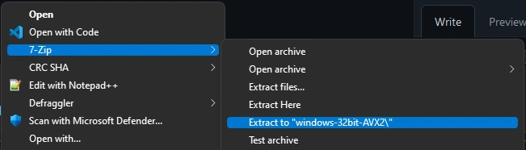
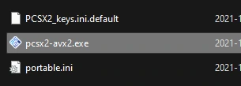

# Nightly Build Usage Guide

## Windows
- Extract  the `.7z` file wherever you'd like.  It's recommend to avoid `Program Files` however!
  - You can get 7zip from https://www.7-zip.org/download.html

- Run the `pcsx2[-avx2].exe` file

## Linux (AppImage)
- You will likely have to make the AppImage file executable. There are a few ways to do this:
  - Right-click and make it executable
  - In a terminal, run `chmod +x <path-to-AppImage-file>`
- You should be able to open the file like any other application.

## Still not Working?
Reach out in the respective help channel in the [Discord](https://discord.com/invite/TCz3t9k)

## Compiling from Source

If you'd prefer to compile from source, see the following articles:
- [Windows](https://github.com/PCSX2/pcsx2/wiki/Setting-up-the-PCSX2-repository-on-Windows)
- [Linux](https://github.com/PCSX2/pcsx2/wiki/Installing-on-Linux)
